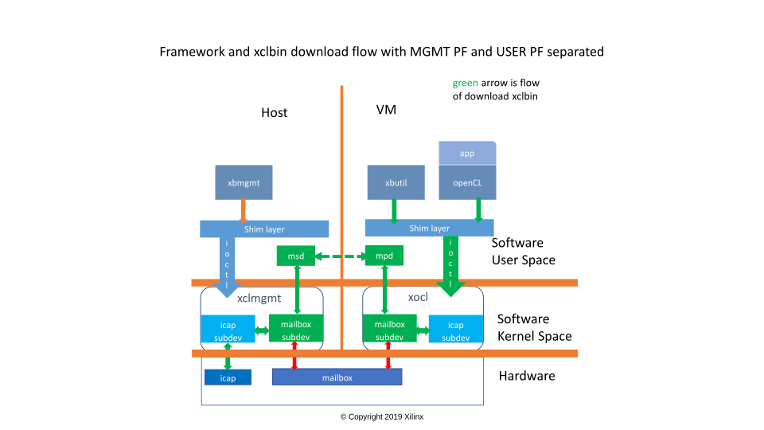
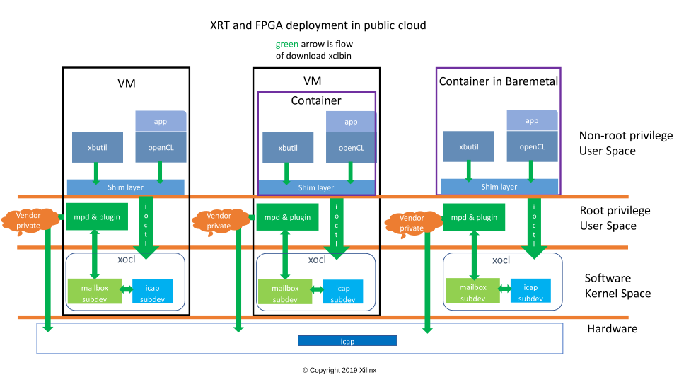

.. _cloud_vendor_support.rst:

Overview
********

When FPGAs are deployed at cloud vendors, either VM based (IaaS) or container based (PaaS), there are
some common concerns need to be addressed.

1. MGMT PF and USER PF of the FPGA are separated
 
   Cloud vendors own the MGMT PF, while users own the USER PF. Any operations by the user on USER PF 
   should not damage or compromise the operation of MGMT PF.

2. xclbin files needs to be protected

   Some of the xclbin files are provided by third-party ISVs -- they don't want to the users access their
   xclbin files, but use them indirectly. That is, the xclbin files in user VM or container are not the 
   real ones that are running on the cards. Instead, they are fake one with the BITSTREAM section stripped.
   xclbin download on the fake xclbin files in VM should result in the real one being programed without any
   user perceiving

3. Cloud vendors have more control on the xclbin download process

   Download xclbin involves the talking between VMs or containers and the hosts. Cloud vendors have their
   own ways they trust to do this.

XRT(2019.2) addresses all of these concerns

Mailbox, Message Service Daemon(MSD) and Message Proxy Daemon(MPD)
==================================================================

.. image:: mailbox-msd-mpd-architecture.svg
   :align: center

XRT has its xclmgmt and xocl driver separated. Mailbox is communication channel between the 2 drivers, with
which the user can do some management works with USER PF in VM, ie. download xclbin. However, HW mailbox by
design has very low bandwidth, and that makes transfer of a hundred Mega Byte xclbin file very slow. SW mailbox
is the complementary to the mailbox framework to overcome this, and it also helps as well for cases where there
are no working HW mailbox.

SW mailbox relies on MSD/MPD, which reside in userspace and talk to the mailbox subdev in xclmgmt and xocl.
MSD/MPD may be connected through external networking, eg. Ethernet, or localhost, and make the download xclbin
faster.

The flow of downloading xclbin through SW mailbox is illustrated as below:

The mailbox(HW&SW) and MSD/MPD framework perfectly addresses the 1st concern mentioned above

Enhancement to MPD
==================

MSD/MPD are mailbox message centric. They focus on the delivering of the mailbox message and don't interpret them.
In order to protect the xclbin file, in which case users feed fake xclbin files to xocl then plugins get real ones
and re-feed to xclmgmt, MSD/MPD have to interpret and understand the download xclbin message. An enhancement to MPD
interprets the mailbox message and calls into vendor specific plugin to download the xclbin.

The input to the plugin is the xclbin file fed by the user in VM or container -- it may be a fake xclbin file. The
plugin calls cloud vendor specific APIs to do the real download. It is the cloud vendor responsibility to,

1. Save the real xclbin files in a dedicated database
2. Retrieve the real xclbin from fake one
3. Ascertain the legality of the download itself
4. Talk to the MGMT PF (xclmgmt driver) to download the real xclbin

In this model, the cloud vendor APIs don't know anything about mailbox. They talk to ICAP through ioctl directly. So
MSD is not being used.

The flow of downloading protected xclbin through plugin is illustrated as below:

.. image:: sw-mailbox-mpd-plugin-download.svg
   :align: center

The enhancement to the MPD and the plugin address the 2nd and 3rd concerns mentioned above

Delivered MPD plugins in XRT 2019.2
===================================

There are 3 MPD plugins delivered in XRT 2019.2, one for Azure, another for AWS, and the 3rd for containers running
on top of baremetal machines (Nimbix)

Azure
-----

The plugin is built as shared object -- libazure_mpd_plugin.so, and when users install the azure pkg, the 'so' file
will be installed at /opt/xilinx/xrt/lib, and a soft link file -- libmpd_plugin.so is created under the same folder
linking to the plugin shared object. MPD tries to dlopen(3) the shared object when it gets started.

Azure uses wireserver to provide RESTful APIs doing the xclbin download. A conf file -- /opt/xilinx/xrt/etc/mpd.conf
is used to specify the IP address of the wireserver.

Azure xclmgmt driver hard-codes mailbox channel switch so that only download xclbin opcode will go through MPD and plugin.

Example how a ubuntu VM configures the plugin

.. code-block:: bash

        # install xrt pkg
        $ sudo apt install /opt/xrt_201920.2.3.0_18.04-xrt.deb

        # install azure pkg
        $ sudo apt install /opt/xrt_201920.2.3.0_18.04-azure.deb

        # config wireserver IP
        $ sudo vi /opt/xilinx/xrt/etc/mpd.conf

        # restart MPD service
        $ sudo systemctl restart mpd

Other IaaS cloud vendors can refer to this plugin to create their own.

AWS
---

The plugin is built as shared object -- libaws_mpd_plugin.so, and when users install the aws pkg, the 'so' file
will be installed at /opt/xilinx/xrt/lib, and a soft link file -- libmpd_plugin.so is created under the same folder
linking to the plugin shared object. MPD tries to dlopen(3) the shared object when it gets started.

AWS has its own FPGA cards which don't have HW mailbox, but AWS does use stock xocl driver. XRT handles this case by creating
pseudo mailbox in xocl driver leveraging the MPD and plugin framework. All mailbox messages are going through pseudo
mailbox, MPD and the plugin. The plugin links to libfpga_mgmt.a provided by AWS, performing AWS hardware specific operations.

With this plugin, AWS can make use of standard XRT shim layer code.

After xrt and aws pkgs are installed in F1, everything is good to go, no extra configurations are required.

Cloud vendors who have their own hardware(FPGA cards) can refer to this plugin to create their own.

Container
---------

The plugin is built as shared object -- libcontainer_mpd_plugin.so, and when users install the container pkg, the 'so' file
will be installed at /opt/xilinx/xrt/lib, and a soft link file -- libmpd_plugin.so is created under the same folder
linking to the plugin shared object. MPD tries to dlopen(3) the shared object when it gets started.

This plugin aims at containers running on top of baremetal machines. In this case, both MGMT PF and USER PF are in the same
domain, so plugin can call ioctl on xclmgmt directly to program ICAP after it retrieves the real xclbin. This is the use case
for Nimbix.

This delivered container plugin by default just uses the input xclbin file as output(that means no xclbin protection),
show-casing how this plugin is going to be implemented. It does have example code how to save real xclbin, how to retrieve
real xclbin from fake one, and how to download a protected xclbin, as user's reference. 

This plugin can also be used for internal test on the MPD and mailbox.

For containers running on top of VMs, essentially it is the same to the Azure case, where the MPD and plugin have been setup
and running in VM.

Example how a ubuntu host of containers configures the plugin

.. code-block:: bash

        # install xrt pkg
        $ sudo apt install /opt/xrt_201920.2.3.0_18.04-xrt.deb

        # install xrt pkg
        $ sudo apt install /opt/xrt_201920.2.3.0_18.04-container.deb

        # config mailbox channel switch
        # this has to be manually configurated to ensure download xclbin going through SW mailbox
        $ sudo echo 0x100 > /sys/bus/pci/devices/0000\:65\:00.0/config_mailbox_channel_switch

        # When cloud vendor (eg. Nimbix) wants to enable its own xclbin protection mechanism, this
        # plugin needs to be rebuilt and the built 'so' needs to be copied to /opt/xilinx/xrt/lib
        # eg
        $ sudo cp libcontainer_mpd_plugin.so /opt/xilinx/xrt/lib
        $ sudo systemctl restart mpd

Summary
*******

With the MSD/MPD framework and MPD enhancement, 

1. Same XRT pkg is installed everywhere, baremetal/aws/azure/nimbix/etc. Vendors only need to install
   their specific pkgs which contain the specific plugins
2. Users have same Xilinx FPGA using experience everywhere -- they don't even know whether they are running
   within baremetal, VM, or containers, they don't know whether the xclbin files they see are real one, fake
   one or any other kind either

The following picture illustrates how XRT is being deployed in different scenarios at cloud vendors

