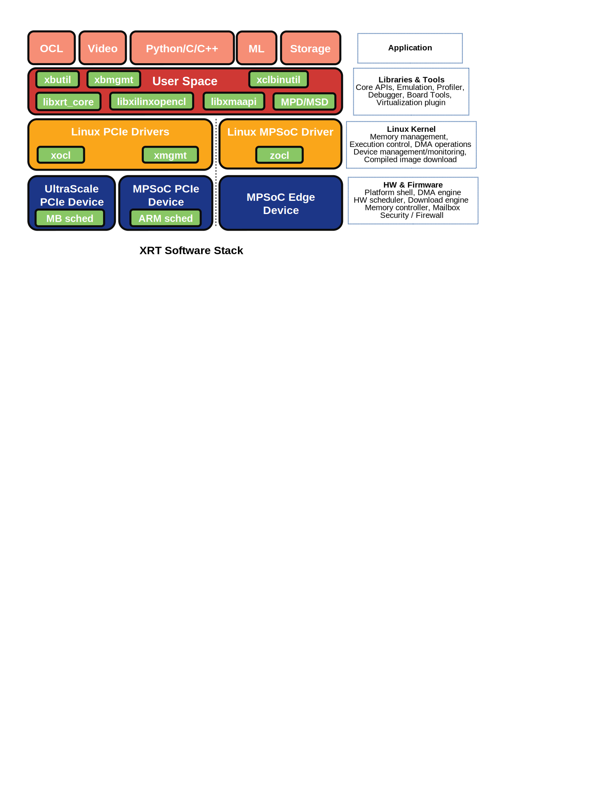

==================================
Xilinx® Runtime (XRT) Architecture
==================================

Xilinx® Runtime (XRT) is implemented as a combination of userspace and kernel
driver components. XRT supports both PCIe based accelerator cards and MPSoC
based embedded architecture provides standardized software interface to Xilinx®
FPGA. The key user APIs are defined in ``xrt.h`` header file.

----------------------------------------------------------------------------

.. toctree::
   :maxdepth: 1
   :caption: Introduction

   platforms.rst
   system_requirements.rst
   build.rst
   install.rst
   test.rst

.. toctree::
   :maxdepth: 1
   :caption: Use Model and Features

   execution-model.rst
   xrt_kernel_executions.rst
   multiprocess.rst
   p2p.rst
   m2m.rst
   sb.rst
   streaming_data_support.rst
   xrt_ini.rst

.. toctree::
   :maxdepth: 1
   :caption: Video Acceleration Using XMA

   xma_user_guide.rst
   xma_19.2.rst

.. toctree::
   :maxdepth: 1
   :caption: User API Library

   opencl_extension.rst
   xrt_native_apis.rst
   xrt.main.rst
   ert.main.rst
   xma.main.rst

.. toctree::
   :caption: XRT Developer's Space
   :maxdepth: 1

   sysfs.rst
   formats.rst
   mgmt-ioctl.main.rst
   xocl_ioctl.main.rst
   zocl_ioctl.main.rst

.. toctree::
   :caption: Tools and Utilities
   :maxdepth: 1

   xclbintools.rst
   xbutil.rst
   xbmgmt.rst

.. toctree::
   :caption: Building Platforms
   :maxdepth: 1

   yocto.rst
   test.rst

.. toctree::
   :caption: Cloud Support
   :maxdepth: 1

   mailbox.main.rst
   mailbox.proto.rst
   cloud_vendor_support.rst

.. toctree::
   :caption: Security
   :maxdepth: 1

   security.rst

.. toctree::
   :caption: Debug and Faqs
   :maxdepth: 1

   debug-faq.rst

----------------------------------------------------------------------------

For any questions on XRT please email runtime@xilinx.com
