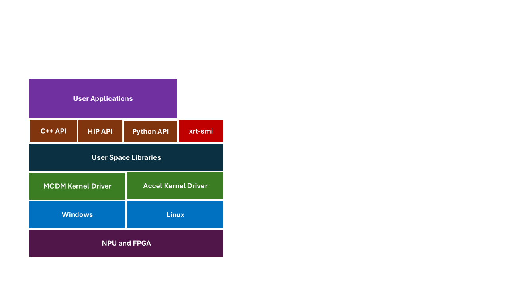

..
   comment:: SPDX-License-Identifier: Apache-2.0
   comment:: Copyright (C) 2019-2021 Xilinx, Inc. All rights reserved.
   comment:: Copyright (C) 2022-2026 Advanced Micro Devices, Inc. All rights reserved.

===================================
FleXible RunTime (XRT) Architecture
===================================

FleXible RunTime (XRT) is implemented as a combination of userspace and kernel
driver components. XRT enables AMD NPU and AMD FPGA via an abstracted software
interface.

   FleXible RunTime (XRT) Stack

----------------------------------------------------------------------------

.. toctree::
   :maxdepth: 1
   :caption: Introduction

   system_requirements.rst
   build.rst
   install.rst

.. toctree::
   :maxdepth: 1
   :caption: Use Model and Features

   xrt_ini.rst

.. toctree::
   :maxdepth: 1
   :caption: User API Library

   xrt_native_apis.rst
   xrt_native.main.rst
   xrt_hip_runtime_api.rst

.. toctree::
   :caption: Tools and Utilities
   :maxdepth: 1

   xclbintools.rst
   xrt-smi.rst
   aiebu.rst

.. toctree::
   :caption: Python binding
   :maxdepth: 1

   pyxrt.rst

----------------------------------------------------------------------------

For any questions on XRT please contact `runtimeca39d@amd.com <mailto:runtimeca39d@amd.com>`
