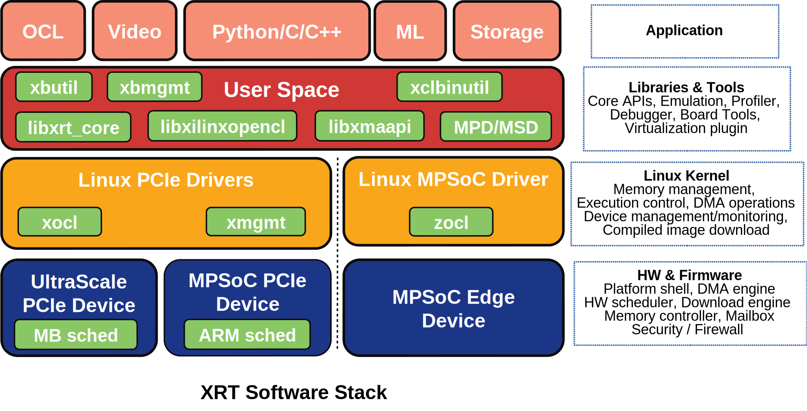

=================================
Xilinx Runtime (XRT) Architecture
=================================

Xilinx Runtime (XRT) is implemented as a combination of userspace and kernel
driver components. XRT supports both PCIe based accelerator cards and MPSoC
based embedded architecture provides standardized software interface to Xilinx
FPGA. The key user APIs are defined in ``xclhal2.h`` header file.

----------------------------------------------------------------------------

.. toctree::
   :maxdepth: 1
   :caption: Table of Contents

   xclhal2.main.rst
   mgmt-ioctl.main.rst
   xocl_ioctl.main.rst
   sysfs.rst
   tools.rst
   ert.main.rst
   multiprocess.rst
   formats.rst
   system_requirements.rst
   build.rst
   test.rst
   debug-faq.rst
