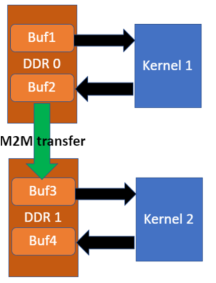

.. _m2m.rst:

Memory-to-Memory (M2M)
**********************

Some of the recent Alveo cards support direct Memory to Memory (M2M) data transfer whithin the card, improving the data transfer performance
as data does not need to be transferred via host while moving from one DDR bank to another.

Example scenario
================
Assume there are two kernels in the XCLBIN, K1 and K2.

K1 interacts with DDR0 due to location proximity on the FPGA.

Similarly, K2 interacts with DDR1 due to location proximity on the FPGA.

The output of the K1 is consumed by K2 for its input. So there has to be data transfer from DDR bank0 to DDR bank1.

In OpenCL host code, let's assume four buffers: Buf1, Buf2, Buf3, Buf4.

So the data transfer from the host follow the order
 Buf1 -> K1 -> Buf2 -> Buf3 -> K2 -> Buf4

We can perform a copy from Buf2 to Buf3 using standard OpenCL API ``clEnqueueCopyBuffer``. See below a code segment.

::

  clEnqueueTask(queue, K1 ,0,nullptr,&events1);
  clEnqueueCopyBuffer(queue, Buf2,Buf3,0,0,Buffer_size, 1, &event1, &event2);
  clEnqueueTask(queue,K2,1,&event2,nullptr);

Some limitations
================
1. Hardware supports M2M between two DDR banks, not other memory types such as HBM or PLRAM
2. The data being copied has to be 64 bit aligned. Otherwise, XRT will do copy via host using the same API
3. Not all the cards are M2M capable, in that case, XRT will do copy via host using the same API
4. M2M copy of OpenCL sub-buffers is not properly supported
