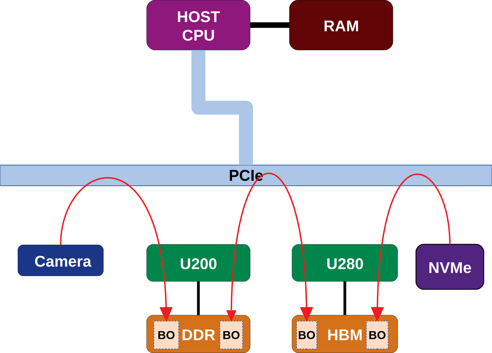

.. _p2p.rst:

PCIe Peer-to-Peer (P2P)
***********************

PCIe peer-to-peer communication (P2P) is a PCIe feature which enables two PCIe devices to directly transfer data between each other without using host RAM as a temporary storage. The latest version of Alveo PCIe platforms support P2P feature via PCIe Resizeable BAR Capability.

1. Data can be directly transferred between the DDR/HBM of one Alveo PCIe device and DDR/HBM of a second Alveo PCIe device.
2. A thirdparty peer device like NVMe can directly read/write data from/to DDR/HBM of Alveo PCIe device.

    PCIe peer-to-peer topology and data transfer

To use P2P, the DDR/HBM on a Alveo PCIe platform need to be mapped to host IO memory space. The total size of DDR/HBM on most Alveo PCIe platforms is 64 GB all of which needs to mapped to the host IO memory space. Partial mapping a smaller range of device DDR is not supported in this release of XRT. Considering not all host systems (CPU/BIOS/chipset) support 64 GB IO memory space, P2P feature is off by default after a cold reboot or power cycle. The feature needs to be explicitly enabled after a cold boot.

Note that in addition to BIOS, host CPU should be capable of supporting a very large physical address space. Most desktop class processors do not support very large address space required for supporting 64 GB BAR together with host RAM and address space of all peripherals.

BIOS Setup
~~~~~~~~~~

1. Before turning on P2P, please make sure 64-bit IO is enabled and the maximium host supported IO memory space is greater than total size of DDRs on Alveo PCIe platform in host BIOS setup.

2. Enable large BAR support in BIOS. This is variously called as *Above 4G decoding*, *PCI 64-bit resource handing above 4G* or *Memory mapped I/O above 4GB* and may be found under PCIe configuration or Boot configuration.

Note
.......
It may be necessary to update to the latest BIOS release before enabling P2P.  Not doing so may cause the system to continuously reboot during the boot process.  If this occurs, power-cycle the system to disable P2P and allow the system to boot normally.

Warning
.......

Mother board vendors have different implementations of large PCIe BAR support in BIOS. If the host system does not support large IO memory well or if host Linux kernel does not support this feature, the host could stop responding after P2P is enabled. Please note that in some cases a warm reboot may not recover the system. Power cycle is required to recover the system in this scenario. As previosuly noted Alveo PCIe platforms turn off P2P after a power cycle.

Some Mother board BIOS setup allows administrator to set IO Memory base address and some do not. Having large IO Memory base could possibly cause OS kernel crash during warm reboot. Warm reboot crash has been observed on Ubuntu running with kernel 4.15 plus IO memory base been set to 56T in BIOS. To avoid this crash, setting IO memory base to 12T in BIOS is recommended. Per our test, the highest P2P BAR physical address has to be less than 32T. And not all Linux kernels have this issue.

Enable/Disable P2P
~~~~~~~~~~~~~~~~~~

XRT ``xbutil`` is used to enable/disable P2P feature and check current configuration. P2P configuration is persistent across warm reboot. Enabling or disabling P2P requires root privilege.

Enabling P2P after cold boot is likly to fail because it resizes an exisitng P2P PCIe BAR to a large size and usually Linux will not reserve large IO memory for the PCIe bridges. XRT driver checks the maximum IO memory allowed by host BIOS setup and returns error if there is not enough IO memory for P2P. A warm reboot is required in this scenario after which BIOS and Linux will reassign the required expanded IO memory resource for P2P BAR.
If a system stops responding after enabling P2P and warm reboot does not recover the host then power cycle is required to recover the host.

Disabling P2P takes effect immediately. Currently XRT does not check if the P2P memory is in use. Administrator needs to make sure P2P is not in use before disabling it. The result of disabling P2P while it is in use is undefined.

The IO memory region will not be completely released after disabling P2P. Thus, re-enabling P2P does not need reboot.

Current P2P Configuration
.........................

``P2P Enabled`` is shown within ``xbutil query`` output.

::

 # xbutil query
 XSA                             FPGA                        IDCode
 xilinx_vcu1525_dynamic_6_0      xcvu9p-fsgd2104-2L-e        0x14b31093
 Vendor          Device          SubDevice       SubVendor
 0x10ee          0x6a9f          0x4360          0x10ee
 DDR size        DDR count       Clock0          Clock1
 34359738368     2               300             500
 PCIe            DMA chan(bidir) MIG Calibrated  P2P Enabled
 GEN 3x16        2               true            false

There are three possible values for ``P2P Enabled`` field above.

============  =========================================================
Value         Remarks
============  =========================================================
``True``      P2P is enabled
``False``     P2P is disabled
``no iomem``  P2P is enabled in device but system could not allocate IO
              memory, warm reboot is needed
============  =========================================================

Enable P2P
..........

Enable P2P after power up sequence.

::

 # xbutil p2p --enable
 ERROR: resoure busy, please try warm reboot
 # xbutil query
 ...
 PCIe            DMA chan(bidir) MIG Calibrated  P2P Enabled
 GEN 3x16        2               true            no iomem
 # reboot
 ...
 # xbutil query
 ...
 PCIe            DMA chan(bidir) MIG Calibrated  P2P Enabled
 GEN 3x16        2               true            true
 ...

Enable P2P without enough IO memory configured in BIOS.

::

 # xbutil p2p --enable
 ERROR: Not enough iomem space.
 Please check BIOS settings

Disable P2P
...........

Disable and re-enable P2P.

::

 # xbutil query
 ...
 PCIe            DMA chan(bidir) MIG Calibrated  P2P Enabled
 GEN 3x16        2               true            true
 ...
 # xbutil p2p --disable
 # xbutil query
 ...
 PCIe            DMA chan(bidir) MIG Calibrated  P2P Enabled
 GEN 3x16        2               true            false
 ...
 # xbutil p2p --enable
 # xbutil query
 ...
 PCIe            DMA chan(bidir) MIG Calibrated  P2P Enabled
 GEN 3x16        2               true            true
 ...

Force Enable/Disable
....................

This is for advanced user. Force enabling P2P is going to free and renumerate all devices under same root bus. The result of failed freeing of devices other than Alveo platform is undefined. The best scenario is there is only Alveo platform under the same root bus.

::

 # xbutil p2p --enable -f
 # xbutil query
 ...
 PCIe            DMA chan(bidir) MIG Calibrated  P2P Enabled
 GEN 3x16        2               true            true
 ...
 # xbutil p2p --disable
 # xbutil query
 ...
 PCIe            DMA chan(bidir) MIG Calibrated  P2P Enabled
 GEN 3x16        2               true            false
 ...

PCIe Topology Considerations
............................

For best performance peer devices wanting to exchange data should be under the same PCIe switch.

If IOMMU is enabled then all peer-to-peer transfers are routed through the root complex which will degrade performance significantly.

P2P Data Transfer between FPGA Cards
~~~~~~~~~~~~~~~~~~~~~~~~~~~~~~~~~~~~

OpenCL coding style
...................

Consider the example situation as below:

  - P2P data transfer from Card1 to Card2
  - Source buffer (`buf_src`) is OpenCL buffer resident of Card1's DDR
  - Destination buffer (`buf_dst`) is OpenCL buffer resident of Card2's DDR

Typical coding style:

  1. In the OpenCL host code, create separate `cl_context` for each `cl_device_id`
  2. Define `buf_src` as regular buffer
  3. Define `buf_dst` as P2P buffer
  4. Import the P2P buffer or `buf_dst` to the context of `buf_src`. Use the following APIs

       - `xclGetMemObjectFd`
       - `xclGetMemObjectFromFd`
  5. Perform the copy operation from `buf_src` to `imported_dst_buf`

.. code-block:: cpp

   // Source Buffer (regular) in source context
   cl_mem src_buf;
   src_buf = clCreateBuffer(src_context, CL_MEM_WRITE_ONLY, buffersize, NULL, &err);
   clSetKernelArg(kernel_1, 0, sizeof(cl_mem), &src_buf);

   // Note: Handling of err is not shown throughout the code example. However, it is recommended
   // to check error for most of the OpenCL APIs

   // Destination buffer (P2P) in destination context
   cl_mem dst_buf;
   cl_mem_ext_ptr_t dst_buf_ext = {0};
   dst_buf_ext.flags = XCL_MEM_EXT_P2P_BUFFER;
   dst_buf = clCreateBuffer(dst_context, CL_MEM_READ_ONLY | CL_MEM_EXT_PTR_XILINX, buffersize, &dst_buf_ext, &err);
   clSetKernelArg(kernel_2, 0, sizeof(cl_mem), &dst_buf);

   // Import Destination P2P buffer to the source context
   err = xclGetMemObjectFd(dst_buf, &fd);

   cl_mem imported_dst_buf;

   err = xclGetMemObjectFromFd(src_context, device_id[0], 0, fd, &imported_dst_buf); // Import

   // Copy Operation: Local Source buffer -> Imported Destination Buffer

   err = clEnqueueCopyBuffer(src_command_queue, src_buf, imported_dst_buf, 0, 0, sizeof(data_t)*LENGTH, 0, NULL, &event);

Profile Report
..............

In the Profile Summary report file the P2P transfer is shown under **Data Transfer: DMA Bypass**

**Data Transfer: DMA Bypass**

+-------+----------------+-----------+------------+-----------+----------+----------+-------------+
| Device|  Transfer Type | Number of |  Transfer  | Total Data| Total    | Average  | Average     |
|       |                | Transfer  |  Rate(MB/s)| Transfer  | Time (ms)| Size (Kb)| Latency(ns) |
+=======+================+===========+============+===========+==========+==========+=============+
| ...   |     IN         |     4096  |    N/A     |    0.262  |    N/A   |   0.064  |      N/A    |
+-------+----------------+-----------+------------+-----------+----------+----------+-------------+

The report shows the P2P transfer corresponding to the receiving device (i.e. transfer type IN).

P2P Data Transfer between FPGA Card and NVMe Device
~~~~~~~~~~~~~~~~~~~~~~~~~~~~~~~~~~~~~~~~~~~~~~~~~~~

Using the P2P enabled device the data can be transferred between the FPGA device and another NVMe Device, such as SMART SSD, without migrating the data via host memory space.

OpenCL coding style
...................

Typical coding style

   1. Create P2P buffer
   2. Map P2P buffer to the host space
   3. Access the SSD location through Linux File System, the file needs to be opened with `O_DIRECT`.
   4. Read/Write through Linux `pread`/`pwrite` function

.. code-block:: cpp

   // Creating P2P buffer
   cl_mem_ext_ptr_t p2pBOExt = {0};

   p2pBOExt.flags = XCL_MEM_EXT_P2P_BUFFER;

   p2pBO = clCreateBuffer(context, CL_MEM_READ_ONLY | CL_MEM_EXT_PTR_XILINX, chunk_size, &p2pBOExt, NULL);

   clSetKernelArg(kernel, 0, sizeof(cl_mem), p2pBO);

   // Map P2P Buffer into the host space

   p2pPtr = (char *) clEnqueueMapBuffer(command_queue, p2pBO, CL_TRUE, CL_MAP_WRITE | CL_MAP_READ, 0, chunk_size, 0, NULL, NULL, NULL);

   filename = <full path to SSD>
   fd = open(filename, O_RDWR | O_DIRECT);

   // Read chunk_size bytes starting at offset 0 from fd into p2pPtr
   pread(fd, p2pPtr, chunk_size, 0);

   // Wrtie chunk_size bytes starting at offset 0 from p2pPtr into fd
   pwrite(fd, p2pPtr, chunk_size, 0);

Profile Report
..............

Sample Profile report from FPGA to NVMe Device transfer via P2P

**Data Transfer: DMA Bypass**

+------+----------------+----------+------------+------------+----------+----------+------------+
|Device|  Transfer Type | Number of| Transfer   | Total Data | Total    | Average  | Average    |
|      |                | Transfer | Rate(MB/s) | Transfer   | Time (ms)| Size (Kb)| Latency(ns)|
+======+================+==========+============+============+==========+==========+============+
| ...  |      OUT       |  8388608 |   N/A      |  1073.740  |    N/A   |  0.128   |  297.141   |
+------+----------------+----------+------------+------------+----------+----------+------------+

Sample Profile report from NVMe Device to FPGA transfer via P2P

**Data Transfer: DMA Bypass**

+------+----------------+----------+------------+------------+----------+----------+------------+
|Device|  Transfer Type | Number of| Transfer   | Total Data | Total    | Average  | Average    |
|      |                | Transfer | Rate(MB/s) | Transfer   | Time (ms)| Size (Kb)| Latency(ns)|
+======+================+==========+============+============+==========+==========+============+
| ...  |      IN        |  4194304 |    N/A     |  1073.740  |    N/A   |  0.256   |  237.344   |
+------+----------------+----------+------------+------------+----------+----------+------------+
