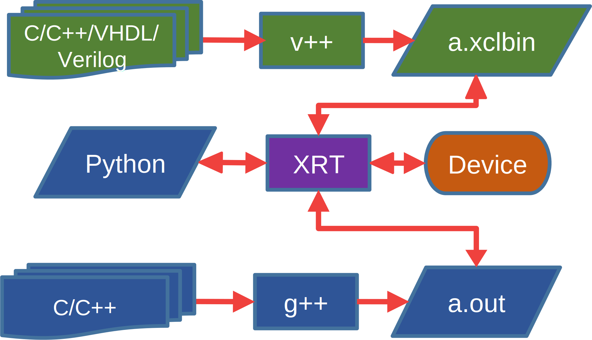
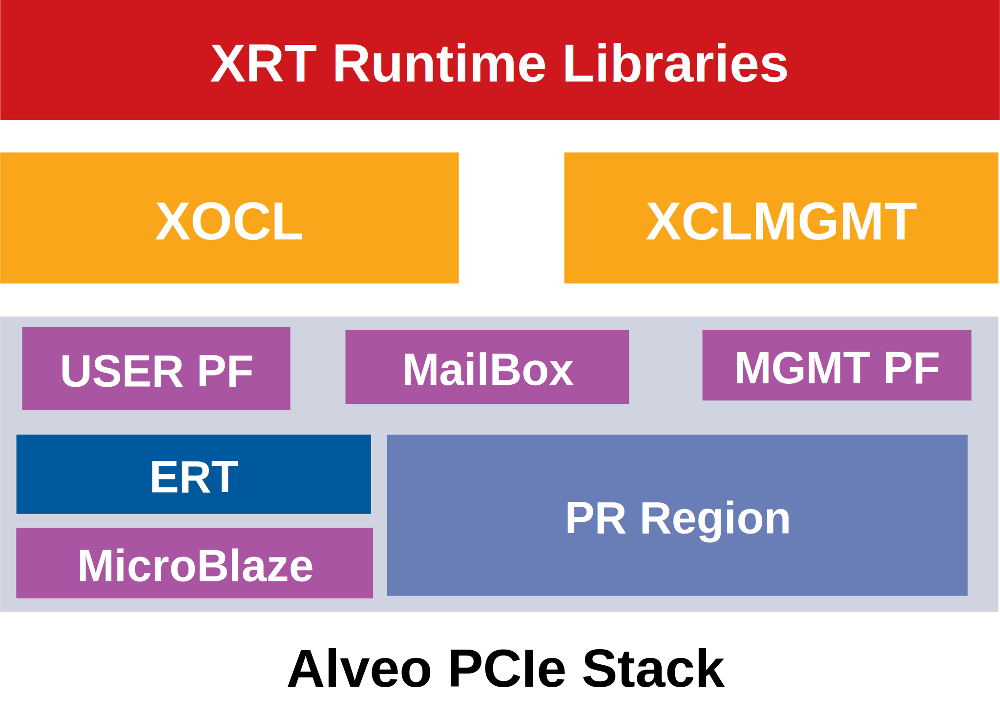
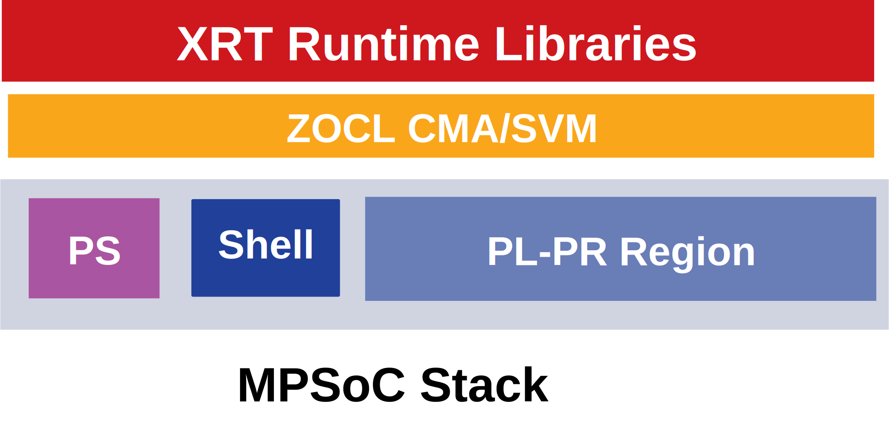
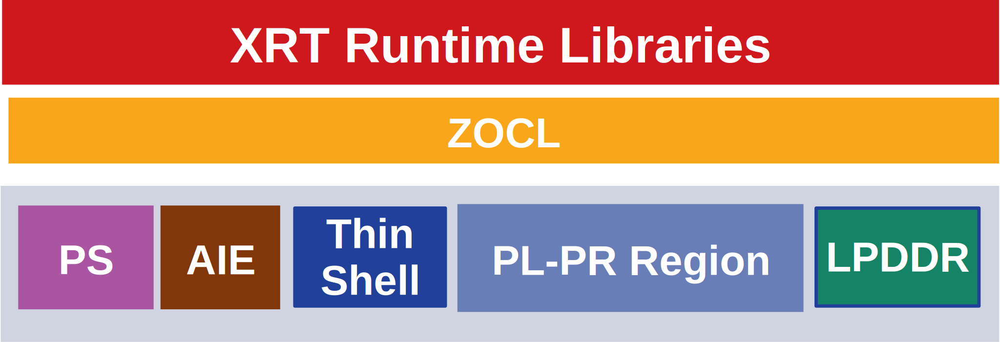

.. _platforms.rst:

XRT and Vitis™ Platform Overview
********************************

XRT exports a common software stack across PCIe based datacenter platforms and ZYNQ UltraScale+ MPSoC/Versal ACAP based embedded platforms. Applications can be seamlessly ported from one class of platform to another with little effort.

User Application Compilation
============================

User application is made up of host code written in C/C++/OpenCL or Python. Device code may be written in C/C++/OpenCL or VHDL/Verilog hardware description language.

    User application compilation and execution

Users use Vitis™ compiler, v++ to compile and link device code for the target platform. Host code written in C/C++/OpenCL may be compiled with gcc/g++. Host code may be written in Python OpenCL (using PyOpenCL) or Python XRT (using builti-in python binding).

PCIe Based Platforms
====================

    Alveo PCIe stack

XRT supports following PCIe based devices:

1. U200
2. U250
3. U280
4. U50
5. AWS F1
6. U30
7. U25
8. VCK5000
9. Advantech VEGA-4000/4002

PCIe based platforms are supported on x86_64, PPC64LE and AARCH64 host architectures. The
platform is comprised of *Shell* and *Dynamic Region*. The Shell (previously known as DSA)
has two physical functions: PF0 also called *mgmt pf* and PF1 also called *user pf*.
Dynamic Region contains *Role* which is user compiled binary. Roles are swapped by user
using process called *Dynamic Function Exchange (DFX)*.

MGMT PF (PF0)
-------------

XRT Linux kernel driver *xclmgmt* binds to management physical function. Management physical function
provides access to Shell components responsible for privileged operations. xclmgmt driver is organized
into subdevices and handles the following functionality:

* User compiled FPGA image (xclbin) download which involves ICAP programming, clock scaling
  and iolsation logic
* Loading firmware container called xsabin. xsabin contains PLP (for 2 RP solution)
  and embedded Microblaze firmwares for ERT and CMC
* Access to in-band sensors: Temperature, Voltage, Current, Power, etc.
* AXI Firewall management in data and control paths
* Flash programmer for shell upgrade
* Device reset and rescan
* Communication with user pf driver xocl via hardware mailbox
* Interrupt handling for AXI Firewall and Mailbox
* Device DNA discovery and validation
* DDR and HBM memory ECC handling

USER PF (PF1)
-------------

XRT Linux kernel driver *xocl* binds to user physical function. User physical function provides access
to Shell components responsible for non privileged operations. It also provides access to compute units
in DFX partition. xocl driver is organized into subdevices and handles the following functionality:

* Device memory topology discovery and memory management
* Device memory management as abstracted buffer objects
* XDMA memory mapped PCIe DMA engine programming
* QDMA streaming DMA engine programming
* Multi-process aware context management
* Compute unit execution management (optionally with help of ERT) for client processes
* Interrupt handling for DMA, Compute unit completion and Mailbox
* Buffer object migration between device and host as DMA operation
* Programming Address-remapper for direct access to host memory by kernels via Slave Bridge (SB)
* Host memory pinning and management
* Buffer import and export via DMA-BUF
* PCIe peer-to-peer buffer mapping and sharing
* Access to in-band sensors via MailBox proxy into xclmgmt
* Hardware mailbox for communication with xclmgmt driver

PCIe platform security and robustness is described in section :ref:`security.rst`.

PCIe Based Hybrid Platforms
---------------------------

.. figure:: XRT-Architecture-Hybrid.svg
    :figclass: align-center

    Alveo PCIe based hybrid stack

PCIe Based Hybrid Platforms like U30 and VCK5000 are MPSoC/Versal platforms. They act as PCIe endpoint and appear as regular PCIe device to PCIe hosts like x86_64 or PPC64LE. They have two physical function architecture similar to other Alveo platforms. On these platforms the ERT subsystem is running on APU.

Zynq-7000 and ZYNQ Ultrascale+ MPSoC Based Embedded Platforms
=============================================================

    MPSoC Embedded stack

    Versal ACAP Embedded stack

XRT supports ZYNQ-7000, ZYNQ Ultrascale+ MPSoC and Versal ACAP. User can create their own embedded platforms
and enable XRT with the steps described :ref:`yocto.rst`.

`Source code <https://github.com/Xilinx/Vitis_Embedded_Platform_Source>`_ and
`pre-built <https://www.xilinx.com/support/download/index.html/content/xilinx/en/downloadNav/embedded-platforms.html>`_
embedded platforms for the following Xilinx evaluation boards are provided:

1. ZC706
2. ZCU102
3. ZCU104
4. ZCU106
5. VCK190

MPSoC and Versal based platforms are supported with PetaLinux based common root filesystem and common kernel.
XRT Linux kernel driver *zocl* does the heavy lifting for the embedded platform. It handles the
following functionality:

* CMA buffer management and cache management
* SMMU programming for SVM platforms
* Compute unit execution management on behalf of client processes
* xclbin download for platforms with Partial Reconfiguration support
* Buffer import and export via DMA-BUF
* Interrupt handling for compute unit completion
* AIE array programming and graph execution
* PL-DDR memory management
* ZynqMP DMA engine programming via well defined API
* AIE GMIO data mover programming via well defined API
