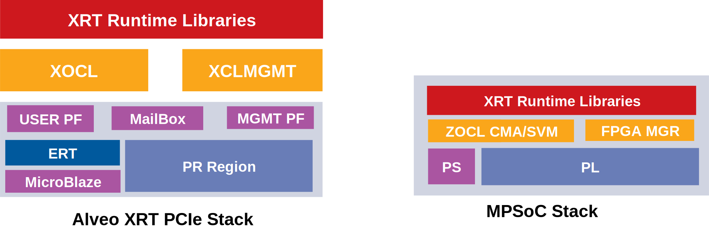

.. _platforms.rst:

Platform Overview
*****************

XRT exports a common stack across PCIe based platforms and MPSoC based platforms.
From user perspective there is very little porting effort when migrating an
application from one class of platform to another.

PCIe Based Platforms
====================

We support below devices:

1. U200
2. U250
3. U280
4. AWS F1
5. Advantech VEGA-4000/4002

PCIe based platforms are supported on x86_64, PPC64LE and AARCH64 host architectures.
The shell (previously known as DSA) has two physical functions: *mgmt pf* and *user pf*.

MGMT PF
-------

XRT Linux kernel driver *xclmgmt* binds to mgmt pf. The driver is organized into subdevices and handles
the following functionality:

1.  ICAP programming
2.  CLock scaling
3.  Loading firmware container, dsabin(renamed to xsabin since 2019.2) (RL Shell for 2 RP solution, embedded Microblaze firmware: ERT, XMC)
4.  In-band sensors: Temperature, Voltage, Current, etc
5.  AXI Firewall management
6.  Access to flash programmer
7.  Device reset and rescan
8.  Hardware mailbox
9.  Interrupt handling for AXI Firewall and Mailbox
10. Device DNA discovery and validation
11. ECC handling

USER PF
-------

XRT Linux kernel driver *xocl* binds to user pf. The driver is organized into subdevices and handles the
following functionality:

1.  Device memory topology discovery and memory management
2.  Device memory management as abstracted buffer objects
3.  XDMA memory mapped PCIe DMA engine programming
4.  QDMA streaming DMA engine programming
5.  Multi-process aware context management
6.  Standardized compute unit execution management (optionally with help of ERT) for client processes
7.  Interrupt handling for DMA, Compute unit completion and Mailbox
8.  Buffer object migration between device and host as DMA operation
9.  Queue creation/deletion read/write operation for sreaming DMA operation
10. AIO support for the streaming queues
11. Buffer import and export via DMA-BUF
12. PCIe peer-to-peer buffer mapping and sharing

Zynq Ultrascale+ MPSoC Based Embedded Platforms
===============================================

We support below platforms:

1. ZCU19
2. ZCU102
3. ZCU104
4. ZCU106

MPSoC based platforms are supported with PetaLinux base stack. XRT Linux kernel
driver *zocl* does the heavy lifting for the embedded platform. It handles the
following functionality

1.  CMA buffer management
2.  SMMU programming for SVM platforms
3.  Standardized compute unit execution management on behalf of client processes
4.  xclbin download for platforms with Partial Reconfiguration support
5.  Buffer import and export via DMA-BUF
6.  Interrupt handling for compute unit completion
