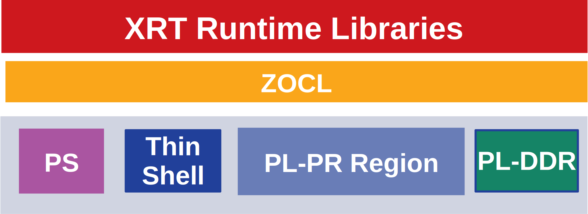

.. _platforms.rst:

=================================
 XRT and Vitis™ Platform Overview
=================================

XRT exports a common software stack across PCIe based datacenter platforms and ZYNQ UltraScale+ MPSoC/Versal ACAP based embedded platforms. Applications can be seamlessly ported from one class of platform to another with little effort.

User Application Compilation
============================

User application is made up of host code written in C/C++/OpenCL or Python. Device code may be written in C/C++/OpenCL or VHDL/Verilog hardware description language.

.. figure:: Alveo-Compilation-Flow.svg
    :figclass: align-center

    User application compilation and execution

Users use Vitis™ compiler, v++ to compile and link device code for the target platform. Host code written in C/C++/OpenCL may be compiled with gcc/g++. Host code may be written in Python OpenCL (using PyOpenCL) or Python XRT (using built-in python binding).

PCIe Based Platforms
====================

.. figure:: XRT-Architecture-PCIe.svg
    :figclass: align-center

    Alveo PCIe stack

XRT supports following PCIe based devices:

1. U200
2. U250
3. U280
4. U50
5. AWS F1
6. U30
7. U25
8. VCK5000
9. Advantech VEGA-4000/4002

PCIe based platforms are supported on x86_64, PPC64LE and AARCH64 host architectures. The
platform is comprised of *Shell* and *Dynamic Region*. The Shell (previously known as DSA)
has two physical functions: PF0 also called *mgmt pf* and PF1 also called *user pf*.
Dynamic Region contains *Role* which is user compiled binary. Roles are swapped by user
using process called *Dynamic Function Exchange (DFX)*.

MGMT PF (PF0)
-------------

XRT Linux kernel driver *xclmgmt* binds to management physical function. Management physical function
provides access to Shell components responsible for privileged operations. xclmgmt driver is organized
into subdevices and handles the following functionality:

* User compiled FPGA image (xclbin) download which involves ICAP (bitstream download) programming, clock
  scaling and isolation logic management.
* Loading firmware container called xsabin which contains PLP (for 2 RP platfroms) and firmwares for
  embedded Microblazes. The embedded Microblazes perform the functionality of ERT and CMC.
* Access to in-band sensors: temperature, voltage, current, power, fan RPM etc.
* AXI Firewall management in data and control paths. AXI firewalls protect shell and PCIe from untrusted Role.
* Shell upgrade by grogramming QSPI flash constroller.
* Device reset and recovery upon detecting AXI firewall trips or explicit request from end user.
* Communication with user pf driver xocl via hardware mailbox. The protocol is defined :ref:`mailbox.proto.rst`
* Interrupt handling for AXI Firewall and Mailbox HW IPs.
* Device DNA (unique ID) discovery and validation.
* DDR and HBM memory ECC handling and reporting.

USER PF (PF1)
-------------

XRT Linux kernel driver *xocl* binds to user physical function. User physical function provides access
to Shell components responsible for non privileged operations. It also provides access to compute units
in DFX partition. xocl driver is organized into subdevices and handles the following functionality which
are exercised using well-defined APIs in ``xrt.h`` header file.

* Device memory topology discovery and device memory management. The driver provides well-defined abstraction
  of buffer objects to the clients.
* XDMA/QDMA memory mapped PCIe DMA engine programming and with easy to use buffer migration API.
* Multi-process aware context management with concurrent access to device by multiple processes.
* Compute unit execution pipeline management with the help of hardware scheduler ERT. If ERT is not available
  then scheduling is completely handled by xocl driver in software.
* Interrupt handling for PCIe DMA, Compute unit completion and Mailbox messages.
* Setting up of Address-remapper tables for direct access to host memory by kernels compiled into Role. Direct
  access to host memory is enabled by Slave Bridge (SB) in the shell.
* Buffer import and export via Linux DMA-BUF infrastructure.
* PCIe peer-to-peer buffer mapping and sharing over PCIe bus.
* Secure communication infrastructure for exchanging messages with xclmgmt driver.
* Memory-to-memory (M2M) programming for moving data between device DDR, PL-RAM and HBM.

Section :ref:`security.rst` describes PCIe platform security and robustness in detail.

PCIe Based Hybrid Platforms
---------------------------

.. figure:: XRT-Architecture-Hybrid.svg
    :figclass: align-center

    Alveo PCIe hybrid stack

U30 and VCK5000 are MPSoC and Versal platforms respectively are considered hybrid devices. They have hardedned PS
subsystem with ARM APUs in the Shell. The PL fabric is exposed as Role. The devices act as PCIe endpoint to PCIe
hosts like x86_64, PPC64LE. They have two physical function architecture identical to other Alveo platforms. On
these platforms the ERT subsystem is running on APU.

Zynq-7000 and ZYNQ Ultrascale+ MPSoC Based Embedded Platforms
=============================================================

    MPSoC Embedded stack

.. figure:: XRT-Architecture-Versal-Edge.svg
    :figclass: align-center

    Versal ACAP Embedded stack

XRT supports ZYNQ-7000, ZYNQ Ultrascale+ MPSoC and Versal ACAP. User can create their own embedded platforms
and enable XRT with the steps described :ref:`yocto.rst`.

`Source code <https://github.com/Xilinx/Vitis_Embedded_Platform_Source>`_ and
`pre-built <https://www.xilinx.com/support/download/index.html/content/xilinx/en/downloadNav/embedded-platforms.html>`_
embedded platforms for the following Xilinx evaluation boards are provided:

1. ZC706
2. ZCU102
3. ZCU104
4. ZCU106
5. VCK190

MPSoC and Versal based platforms are supported with PetaLinux based common root filesystem and common
kernel. XRT Linux kernel driver *zocl* does the heavy lifting for the embedded platform. It handles the
following functionality with well defined APIs in ``xrt.h`` and ``xrt_aie.h`` (for AIE) header files.

* PS memory CMA buffer management and cache management. On SVM enabled platforms zocl also manages SMMU. The driver provides
  well-defined abstraction of buffer objects to the clients.
* Compute unit execution pipeline management for clients.
* User compiled FPGA image (xclbin) for platforms with Partial Reconfiguration support.
* Buffer object import and export via DMA-BUF.
* Interrupt handling for compute unit completion.
* AIE array programming and graph execution.
* If PL-DDR memory is enabled by instantiating MIG in PL, zocl provides memory management similar to PS memory.
* ZynqMP DMA engine programming for moving data between PS DDR and PL-DDR.
* AIE GMIO data mover programming to move data between NOC and AIE.

Section :ref:`execution-model.rst` provides a high level overview of execution model.
