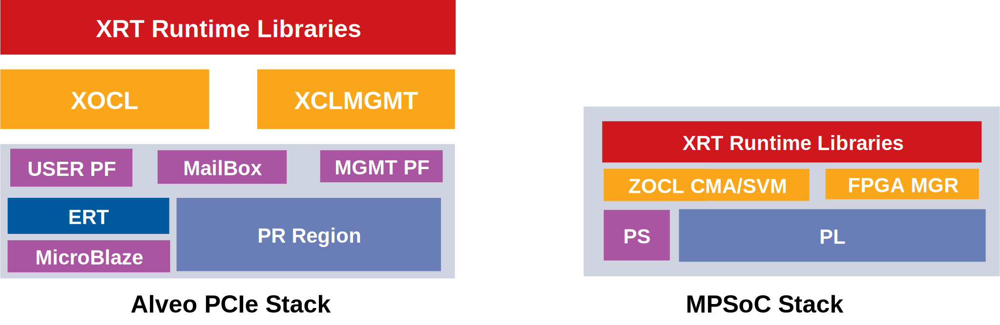

.. _platforms.rst:

Platform Overview
*****************

XRT exports a common stack across PCIe based platforms and MPSoC based platforms.
From user perspective there is very little porting effort when migrating an
application from one class of platform to another.

PCIe Based Platforms
====================

1. VCU1525
2. Alveo U200
3. Alveo U250
4. Alveo U280
5. AWS F1

Alveo PCIe platforms are supported on x86_64, PPC64LE and AARCH64 host architectures. AWS F1 is only supported on AWS host architectures.

Alveo PCIe platforms have a *shell* which is static and a reconfigurable (dynamic) region. The shell is automatically loaded from PROM when host is booted and cannot be changed till next cold reboot. The shell (previously known as DSA) has two physical functions: Management Physical Function and User Physical Function. Dynamic region contents are compiled by the user using SDx compiler tool chain like xocc which produces *xclbin* file.

MGMT PF
-------

XRT Linux kernel driver *xclmgmt* binds to mgmt pf. The driver is modular and organized into several platform drivers which handle the following functionality:

1.  ICAP programming
2.  CLock scaling
3.  Loading firmware container also called dsabin (embedded Microblaze firmware for ERT and XMC, optional clearing bitstream)
4.  In-band sensors: Temp, Voltage, Power, etc.
5.  AXI Firewall management
6.  Access to Flash programmer
7.  Device reset and rescan
8.  Hardware mailbox
9.  Interrupt handling for AXI Firewall and mailbox
10. ECC handling

USER PF
-------

XRT Linux kernel driver *xocl* binds to user pf. The driver is modular and organized into several platform drivers which handle the following functionality:

1. Device memory topology discover and memory management
2. Buffer object abstraction and management for client process
3. XDMA MM PCIe DMA engine programming
4. QDMA Streaming DMA engine programming
5. Multi-process aware context management
6. Standardized compute unit execution management (optionally with help of ERT) for client processes
7. Interrupt handling for DMA, compute unit completion and mailbox

Zynq Ultrascale+ MPSoC Based Embedded Platforms
===============================================

1. ZCU19
2. ZCU102
3. ZCU104
4. ZCU106

MPSoC based platforms are supported with PetaLinux base stack. XRT Linux kernel
driver *zocl* does the heavy lifting for the embedded platform. It handles the
following functionality

1. CMA buffer management
2. SMMU programming for SVM platforms
3. Standardized compute unit execution management on behalf of client processes
4. xclbin download for platforms with Partial Reconfiguration support
5. Interrupt handling for compute unit completion
