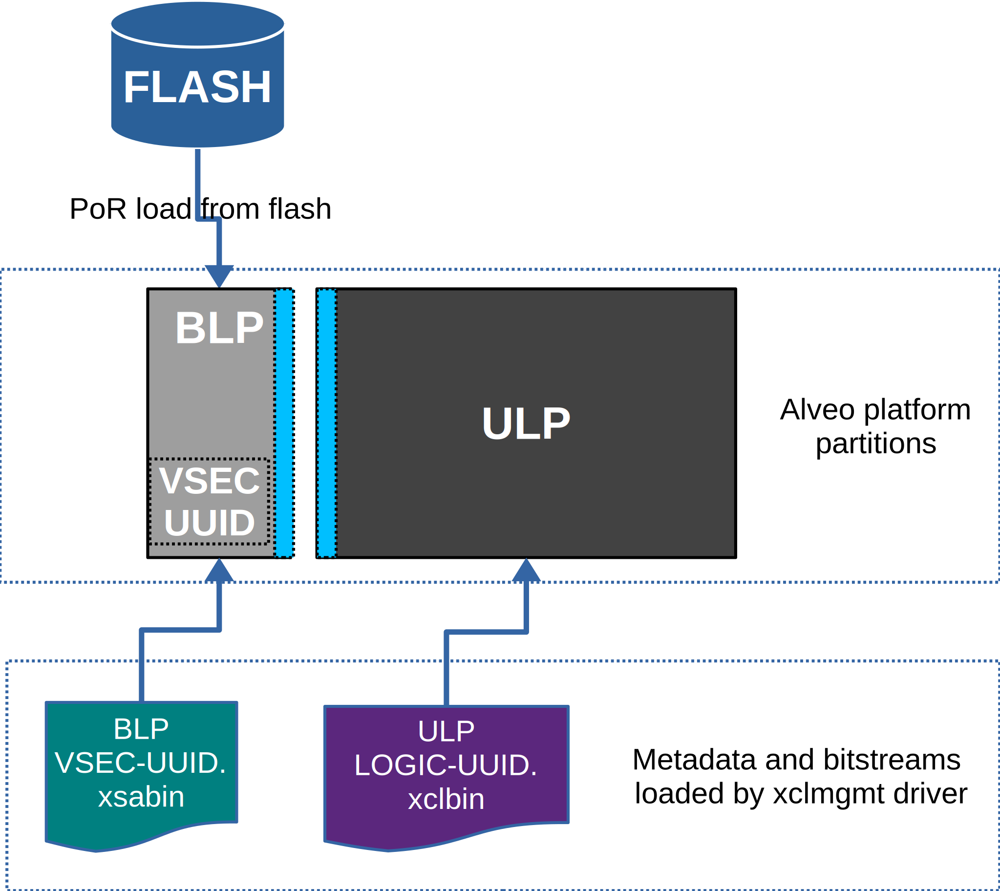
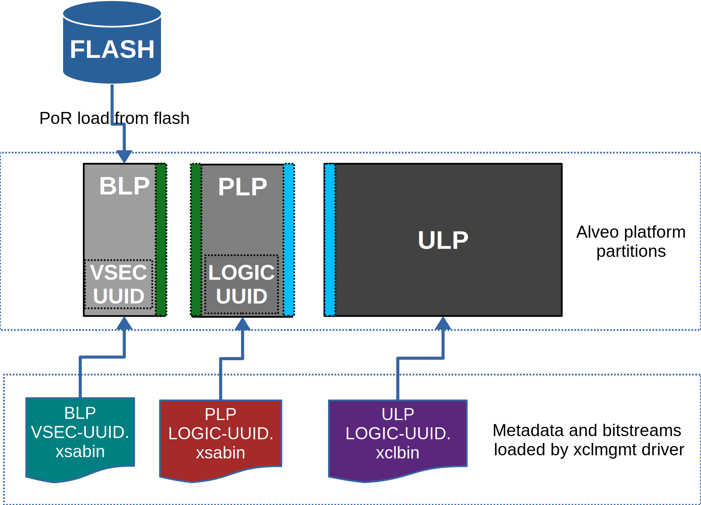

.. _platform_partitions.rst:

=================================
 Alveo™ Platform Loading Overview
=================================

Alveo platforms are architected as two logical FPGA partitions: *shell* and *role*. In 1RP platforms like U30 and U50 shell contains only one fixed physical partition called BLP. In 2RP platforms shell contains a fixed physical partition called BLP and a loadable physical partition called PLP. For both class of platforms the role partition is made of physical partition called ULP that can be loaded by end user. Every physical partition has two interface UUIDs: parent UUID and child UUID.

.. note::
   Partition compatibility matching is key part of Alveo platforms and XRT. The partitions have child and parent relationship. A loaded partition exposes child partition UUID to advertise its compatibility requirement for child partition. When loading a child partition the xclmgmt management driver matches parent UUID of the child partition against child UUID exported by the parent. Parent and child partition UUIDs are stored in the xclbin (for ULP) or xsabin (for BLP and ULP).

BLP
===

    Alveo shell partitions and loading for 1RP platform

BLP partition is loaded from flash at system boot time. It establishes the PCIe link and exposes two physical functions to the BIOS. After OS boot, xclmgmt driver attaches to BLP physical function 0 and then looks for VSEC in PCIe extended configuration space. Using VSEC it determines the logic UUID of BLP and uses the UUID to load matching *xsabin* from Linux firmware directory. The xsabin contains metadata to discover peripherals that are part of BLP and firmware(s) for any embedded processors in BLP. In 1RP platforms *all* the shell peripherals are present in the BLP itself. In 2RP platforms only a small set of peripherals such as ICAP, QSPI controller, AXI Firewalls etc. are present in BLP.

BLP exports unique interface UUID which is used to match the next stage of the platform load: ULP for 1RP platforms and BLP for 2RP platforms. In 1RP platforms when loading ULP xclbin (the role), the xclmgmt management driver reads the parent interface UUID stored in the ULP xclbin and matches it with child UUID exported by BLP to determine if xclbin is compatible with the BLP. If match fails loading is denied.

In 2RP platforms when loading PLP xsabin, the xclmgmt management driver reads the parent interface UUID stored in the PLP xsabin and matches it with child UUID exported by BLP to determine if xsabin is compatible with the BLP. If match fails loading is denied.

PLP
===

    Alveo shell partitions and loading for 2RP platform

In 2RP platforms, PLP partition contains additional shell components such as PCIe DMA engine, AXI Firewalls, Address Re-mapper, ERT, etc. PLP partition is explicitly loaded by system administrator using ``xbmgmt partition`` command. After PLP partition is loaded, xclmgmt driver posts ``XCL_MAILBOX_REQ_MGMT_STATE`` message to the xocl driver via mailbox to indicate shell has changed. xocl driver then requests for metadata via ``XCL_MAILBOX_REQ_PEER_DATA`` opcode. xclmgmt managemet driver responds by sending relevant information about shell components such as XDMA that should be managed by xocl driver. A system administrator can pre-load a PLP based on the workload the system is being provised for. A new PLP xsabin load clobbers previous PLP and ULP images.

ULP
===

ULP partition contains user compiled components like acceleration engines/compute kernels, Memory subsystem, etc. ULP is loaded by the end user using ``xbutil program`` command. Users use Vitis™ v++ compiler to compile ULP xclbins. Users can dynamically load any compatible xclbin based on their workload requirements. A new ULP xclbin load clobbers previous ULP image.

.. note::
   Refer to :ref:`mailbox.main.rst` for detailed steps followed by xocl and xclmgmt drivers for loading PLP and ULP.
