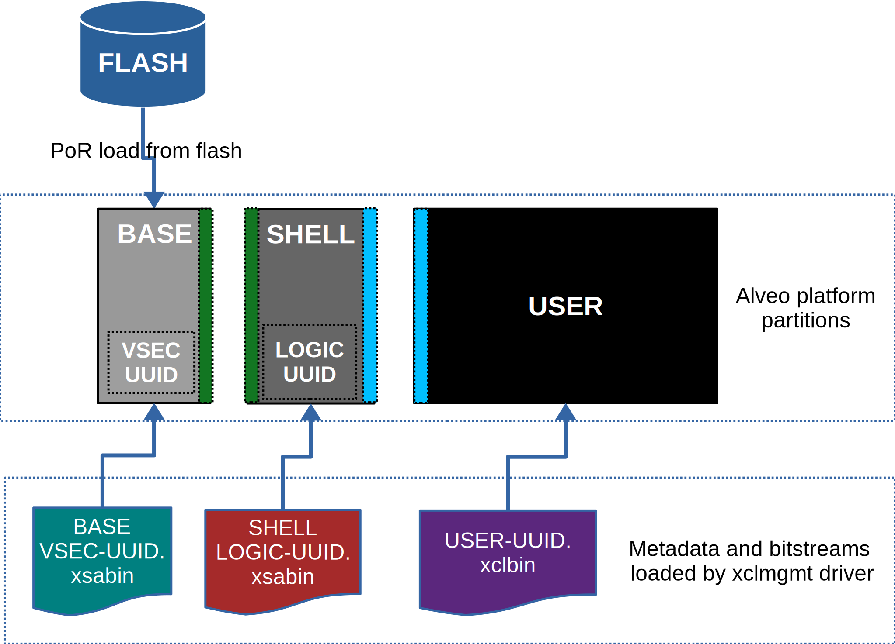

.. _platform_partitions.rst:

=================================
 Alveo™ Platform Loading Overview
=================================

Alveo platforms are architected as two physical FPGA partitions: *Shell* and *User*. Shell provides basic infrastructure
for the platform like PCIe connectivity, board management, DFX support, sensors, clocking, reset, etc. :ref:`security.rst`
enumerates the shell functionality in detail. User partition contains user compiled binary called xclbin which is loaded by XRT using
DFX technology.

There is a variation of Alveo platform called two stage platform here where the Shell is further split into two partitions: a
thin partition called *Base* and second partition called *Shell*.

Physical partitions require strict HW compatibility with each other for DFX to work properly. Hence every physical partition
has two interface UUIDs: *parent* UUID and *child* UUID. For simple single stage platforms Shell → User forms parent child
relationship. For complex two stage platforms Base → Shell → User forms the parent child relationship chain.

.. note::
   Partition compatibility matching is key design component of Alveo platforms and XRT. Partitions have child and parent relationship. A loaded partition exposes child partition UUID to advertise its compatibility requirement for child partition. When loading a child partition the xclmgmt management driver matches parent UUID of the child partition against child UUID exported by the parent. Parent and child partition UUIDs are stored in the xclbin (for user) or xsabin (for base and shell).

Single Stage Platforms
======================

As mentioned before simple platforms have two partitions: Shell and User.

Shell
-----

.. figure:: XSA-shell-partitions-1RP.svg
    :figclass: align-center

    Alveo shell partitions and loading for simple platform

Shell partition is loaded from flash at system boot time. It establishes the PCIe link and exposes two physical functions to the BIOS. After OS boot, xclmgmt driver attaches to PCIe physical function 0 exposed by the Shell and then looks for VSEC in PCIe extended configuration space. Using VSEC it determines the logic UUID of Shell and uses the UUID to load matching *xsabin* file from Linux firmware directory. The xsabin file contains metadata to discover peripherals that are part of Shell and firmware(s) for any embedded processors in Shell.

When xocl driver comes online it requests for Shell metadata via ``XCL_MAILBOX_REQ_PEER_DATA`` opcode over mailbox. xclmgmt managemet driver responds by sending relevant information about shell components such as XDMA or Address Re-mapper that should be managed by xocl driver.

Shell exports child interface UUID which is used for compatbility check when loading user compiled User partition as part of DFX. The xclmgmt management driver reads the parent interface UUID stored in the User xclbin and matches it with child interface UUID exported by Shell to determine if User xclbin is compatible with the Shell. If match fails loading of xclbin is denied.

Two Stage Platforms
===================

As mentioned before complex platforms have three partitions: Base, Shell and User.

Base
----

Base partition is loaded from flash at system boot time. It establishes the PCIe link and exposes two physical functions to the BIOS. After OS boot, xclmgmt driver attaches to physical function 0 exposed by Base and then looks for VSEC in PCIe extended configuration space. Using VSEC it determines the logic UUID of Base and uses the UUID to load matching *xsabin* from Linux firmware directory. The xsabin contains metadata to discover peripherals that are part of Base and firmware(s) for any embedded processors in Base. Base only contains essential peripherals such as ICAP, QSPI controller, AXI Firewalls etc.

Base exports child interface UUID which is used for compatbility check when loading vendor provided Shell partition as part of DFX. The xclmgmt management driver reads the parent interface UUID stored in the Shell xsabin and matches it with child interface UUID exported by Base to determine if Shell xsabin is compatible with the Base. If match fails loading of xsabin is denied.

Shell
-----

    Alveo shell partitions and loading for 2RP platform

In two stage platforms, Shell partition contains additional shell components such as PCIe DMA engine, AXI Firewalls, Address Re-mapper, ERT, etc. Shell partition is explicitly loaded by system administrator using ``xbmgmt partition`` command. After Shell partition is loaded, xclmgmt driver posts ``XCL_MAILBOX_REQ_MGMT_STATE`` message to the xocl driver via mailbox to indicate shell has changed. xocl driver then requests for metadata via ``XCL_MAILBOX_REQ_PEER_DATA`` opcode. xclmgmt managemet driver responds by sending relevant information about shell components such as XDMA that should be managed by xocl driver. A system administrator can pre-load a Shell based on the workload the system is being provised for. A new Shell xsabin load clobbers previous Shell and User images.

User
====

User partition contains user compiled components like acceleration engines/compute kernels etc. It is loaded by xclmgmt driver on request by user. XRT provides API ``xclLoadXclBin()`` and command line utility ``xbutil program`` to help load xclbins. This allows users to dynamically swap the image running on User parition to meet their workload requirements.

.. note::
   Refer to :ref:`mailbox.main.rst` for detailed protocol used by xocl and xclmgmt drivers for loading Shell xsabin and User xclbin.
