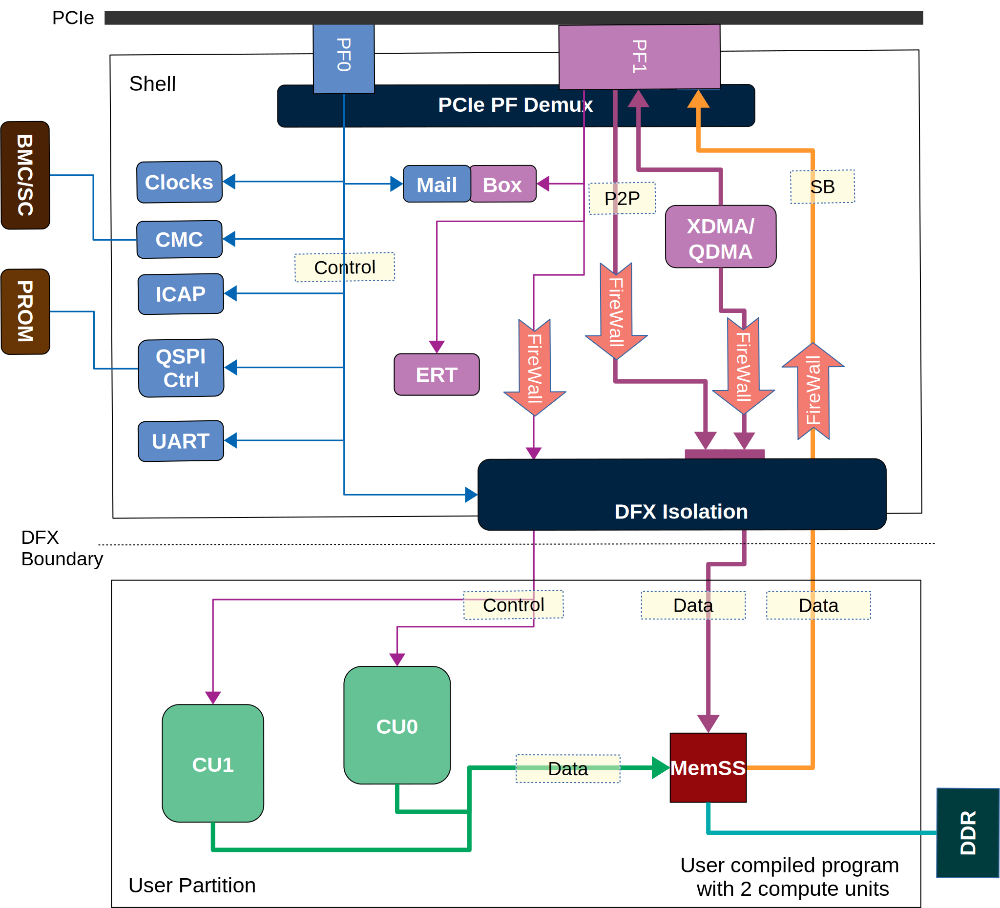

.. _security.rst:

Security of Alveo Platform
**************************

    Alveo shell mgmt and user components, data and control paths

Security is built into Alveo platform hardware and software architecture. The platform
is made up of two fixed physical partitions: an immutable Shell and user compiled DFX partition (Role).
This design allows end users to perform Dynamic Function eXchange (Partial Reconfiguration
in classic FPGA terminology) in the well defined DFX partition while the static Shell
provides key infrastructure services. Alveo shells assume PCIe host (with access to PF0) is
part of *Root-of-Trust*. The following features reinforce security of the platform:

1. Two physical function shell design
2. Trusted vs untrusted peripherals
3. Signing of xclbins
4. AXI Firewall
5. Well-defined compute kernel execution model
6. No direct access to PCIe TLP

Shell
=====

The Shell provides core infrastructure to the Alveo platform. It includes *hardened* PCIe
block which provides physical connectivity to the host PCIe bus via two physical functions
as described in :ref:`platforms.rst`.
The Shell is *trusted* partition of the Alveo platform and for all practical purposes
should be treated like an ASIC. During system boot, the shell is loaded from the PROM.
Once loaded, the Shell cannot be changed.

In the figure above, the Shell peripherals shaded blue can only be accessed from *management*
physical function 0 (PF0) while those shaded violet can be accessed from *user* physical
function 1 (PF1). From PCIe topology point of view PF0 *owns* the device and performs
supervisory actions on the device. It is part of *Root-of-Trust*. Peripherals shaded blue
are trusted while those shaded violet are not. Alveo shells use a specialized IP called
**PCIe Demux** which routes PCIe traffic destined for PF0 to PF0 AXI network and those destined
for PF1 to PF1 AXI network. It is responsible for the necessary isolation between PF0 and PF1.

Trusted peripherals includes ICAP for bitstream download (DFX), CMC for sensors and thermal
management, Clock Wizards for clock scaling, QSPI Ctrl for PROM access (shell upgrades), DFX
Isolation, Firewall controls and ERT UART.

All peripherals in the shell except XDMA/QDMA are slaves from PCIe point of view and cannot
initiate PCIe transactions. Alveo shells have one of XDMA or QDMA PCIe DMA engine. Both
`XDMA <https://www.xilinx.com/support/documentation/ip_documentation/xdma/v4_1/pg195-pcie-dma.pdf>`_ and
`QDMA <https://www.xilinx.com/support/documentation/ip_documentation/qdma/v3_0/pg302-qdma.pdf>`_
are regular PCIe scatter-gather DMA engine with a well defined programming model.

The Shell provides a *control* path and a *data*
path to the user compiled image loaded on DFX partition. The Firewalls in control and data
paths protect the Shell from un-trusted DFX partition. For example if a slave in DFX has a
bug or is malicious the appropriate firewall will step in and protect the Shell from the
failing slave as soon as a non compliant AXI transaction is placed on AXI bus.

Newer revisions of shell have a feature called Slave Bridge which provides direct access to host
memory from kernels in the DFX partition. With this feature kernels can initiate PCIe burst
transfers from PF1 without direct access to PCIe bus. AXI Firewall (SI) in reverse direction protects
PCIe from non-compliant transfers.

For more information on firewall protection see `Firewall`_ section below.

For shell update see `Shell Update`_ section below.

Dynamic Function eXchange
=========================

User compiled image packaged as xclbin is loaded on the Dynamic Functional eXchange
partition by the Shell. The image may be signed with a private key and its public
key registered with Linux kernel keyring. The xclbin signature is validated by
xclmgmt driver. This guarantees that only known good user compiled images are loaded by
the Shell. The image load is itself effected by xclmgmt driver which binds to PF0.
xclmgmt driver downloads the bitstream packaged in the bitstream section of xclbin by
programming the ICAP peripheral. The management driver also discovers the target frequency
of the DFX partition by reading the xclbin clock section and then programs the clocks
which are controlled from Shell. DFX is exposed as one atomic ioctl by xclmgmt driver.

xclbin is a container which packs FPGA bitstream for the DFX partition and host of related
metadata like clock frequencies, information about instantiated compute units, etc. The
compute units typically expose a well defined register space on the PCIe BAR for access by
XRT. An user compiled image does not have any physical path to directly interact with PCIe
Bus. Compiled images do have access to device DDR.

More information on xclbin can be found in :ref:`formats.rst`.

Xclbin Generation
=================

Users compile their Verilog/VHDL/OpenCL/C/C++ design using Vitis™ compiler, v++ which also takes
the shell specification as a second input. By construction the Vitis™ compiler, v++ generates image
compatible with DFX partition of the shell. The compiler uses a technology called *PR Verify*
to ensure that the user design physically confines itself to DFX partition and does not attempt
to overwrite portions of the Shell. It also validates that all the IOs between the DFX and
Shell are going through fixed pins exposed by Shell.

Signing of Xclbins
==================

xclbin signing process is similar to signing of Linux kernel modules. xclbins can be signed by
XRT **xclbinutil** utility. The signing adds a PKCS7 signature at the end of xclbin. The signing
certificate is then registered with appropriate key-ring. XRT supports one of three levels of
security which can be configured with XRT **xbmgmt** utility running with root privileges.

=============== =================================================================
Security level  Xclbin signature verification behavior of xclmgmt driver
=============== =================================================================
0               No verification
1               Signature verification enforced using signing certificate in
                *.xilinx_fpga_xclbin_keys* key-ring
2               Linux is running in UEFI secure mode and signature verification
                is enforced using signing certificate in *system* key-ring
=============== =================================================================

Firewall
========

Alveo hardware design uses standard AXI bus. As shown in the figure the control path uses AXI-Lite
and data path uses AXI4 full. Specialized hardware element called
`AXI Protocol Firewall <https://www.xilinx.com/support/documentation/ip_documentation/axi_firewall/v1_0/pg293-axi-firewall.pdf>`_
monitors all transactions
going across the bus into the un-trusted DFX partition. It is possible that one or more AXI slave in the DFX
partition is not fully AXI-compliant or deadlocks/stalls/hangs during operation. When an AXI slave in DFX
partition fails, AXI Firewall *trips* -- it starts completing AXI transactions on behalf of the slave so the
master and the specific AXI bus is not impacted -- to protect the Shell. The AXI Firewall starts completing
all transactions on behalf of misbehaving slave while also notifying the mgmt driver about the trip. The
xclmgmt driver then starts taking recovery action. xclmgmt posts a message to xocl using MailBox to inform
the peer about FireWall trip. xocl can suggest a reset by sending a reset command to xclmgmt on MailBox. Note
that even if no reset is performed the AXI Protocol Firewall will continue to protect the host PCIe bus. DFX
partition will be unavailable till device is reset. **A reboot of host is not required to reset the device.**

AXI Firewall in Slave Interface (SI) mode also protects the host from errant transactions initiated by kernels over
Slave Bridge. For example if an AXI master kernel in the Dynamic Region issues a non compliant AXI transaction like
starting a burst transfer but stalling afterwards, the AXI Firewall (SI) will complete the transaction on behalf of the
failing kernel. This protects PCIe from un-correctable errors.

PCIe Bus Safety
===============

As explained in the Firewall section above PCIe bus is protected by AXI Firewalls on both control and data path.
DFX Isolation only exposes AXI bus (AXI-Lite for control and AXI-Full for data paths) to the Dynamic Region. Kernels
compiled by user which sit in Dynamic Region do **not have direct access to PCIe bus** and hence cannot generate TLP
packets. This removes the risk of an errant Role compromising the PCIe bus and taking over the host system. PCIe Demux
IP ensures that all PCIe transactions mastered by device over P2P, XDMA/QDMA and SB data paths are only possible over
PF1. This is critical for `Pass-through Virtualization`_ where host should not see any transactions initiated by PF1.

Deployment Models
=================

In all deployment models PCIe host with access to PF0 is considered part of *Root-of-Trust*.

Baremetal
---------

In Baremetal deployment model, both physical functions are visible to the end user who *does not*
have root privileges. End user have access to both XRT **xclmgmt** and XRT **xocl** drivers. The system
administrator trusts both drivers which provide well defined :ref:`mgmt-ioctl.main.rst` and :ref:`xocl_ioctl.main.rst`.
End user does have the privilege to load xclbins which should be signed for maximum security. This
will ensure that only known good xclbins are loaded by end users.

Certain operations like resetting the board and upgrading the flash image on PROM (from which the shell
is loaded on system boot) require root privileges and are effected by xclmgmt driver.

Pass-through Virtualization
---------------------------

In Pass-through Virtualization deployment model, management physical function (PF0) is only visible to the host
but user physical function (PF1) is visible to the guest VM. Host considers the guest VM a *hostile* environment.
End users in guest VM may be root and may be running modified implementation of XRT **xocl** driver -- XRT
**xclmgmt** driver does not trust XRT xocl driver. xclmgmt as described before exposes well defined
:ref:`mgmt-ioctl.main.rst` to the host. In a good and clean deployment end users in guest VM interact with
standard xocl using well defined :ref:`xocl_ioctl.main.rst`.

As explained under the Shell section above, by design xocl has limited access to violet shaded Shell peripherals.
This ensures that users in guest VM cannot perform any privileged operation like updating flash image or device
reset. A user in guest VM can only perform operations listed under USER PF (PF1) section in :ref:`platforms.rst`.

A guest VM user can potentially crash a compute unit in DFX partition, deadlock data path AXI bus or corrupt
device memory. If the user has root access he may compromise VM memory. But none of this can bring down the
host or the PCIe bus. Host memory is protected by system IOMMU. Device reset and recovery is described below.

A user cannot load a malicious xclbin on the DFX partition since xclbin downloads are done by xclmgmt
drive. xclbins are passed on to the host via a plugin based MPD/MSD framework defined in
:ref:`mailbox.main.rst`. Host can add any extra checks necessary to validate xclbins received from guest VM.

This deployment model is ideal for public cloud where host does not trust the guest VM. This is the prevalent
deployment model for FaaS operators.

Summary
-------

+------------------------------+---------------------------+
| Behavior                     |     Deployment Model      |
|                              +------------+--------------+
|                              | Bare Metal | Pass-through |
+=================+============+============+==============+
| System admin    | xocl       | Yes        | No           |
| trusts drivers  +------------+------------+--------------+
|                 | xclmgmt    | Yes        | Yes          |
+-----------------+------------+------------+--------------+
| End user has    | xocl       | No         | Maybe        |
| root access     +------------+------------+--------------+
|                 | xclmgmt    | No         | No           |
+-----------------+------------+------------+--------------+
| End user can crash device    | Yes        | Yes          |
+------------------------------+------------+--------------+
| End user can crash PCIe bus  | No         | No           |
+------------------------------+------------+--------------+
| End user with root access    | Yes        | No           |
| can crash PCIe bus           |            |              |
+------------------------------+------------+--------------+

Mailbox
=======

Mailbox is used for communication between user physical function driver, xocl and management physical
function driver, xclmgmt. The Mailbox hardware design and xclmgmt driver mailbox handling implementation
has the ability to throttle requests coming from xocl driver which protects it from a potential DoS
initiated by a malicious xocl driver. :ref:`mailbox.main.rst` has details on mailbox usage.

Device Reset and Recovery
=========================

Device reset and recovery is a privileged operation and can only be performed by xclmgmt driver. xocl
driver can request device reset by sending a message to xclmgmt driver over the Mailbox. An end user
can reset a device by using XRT **xbutil** utility. This utility talks to xocl driver which uses the reset
message as defined in :ref:`mailbox.main.rst`

Currently Alveo boards are reset by using PCIe bus *hot reset* mechanism. This resets the board peripherals
and also the PCIe link. As part of reset, drivers kill all the clients which have opened the device node by
sending them a SIGBUS.

Shell Update
============

Shell update is like firmware update in conventional PCIe devices. Shell updates are distributed as signed
RPM/DEB package files by Xilinx®. Shells may be upgraded using XRT **xbmgmt** utility by system administrators
only. The upgrade process will update the PROM. A cold reboot of host is required in In order to boot the
platform from the updated image.

Compute Kernel Execution Models
===============================

XRT and Alveo support software defined compute kernel execution models having standard AXI hardware
interfaces. More details on :ref:`xrt_kernel_executions.rst`. These well understood models do not require
direct register access from user space. To execute a compute kernel XRT has a well defined *exec command buffer*
API and a *wait for exec completion* API. These operations are exposed as ioctls by the xocl driver.
