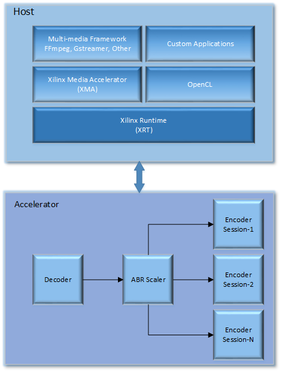
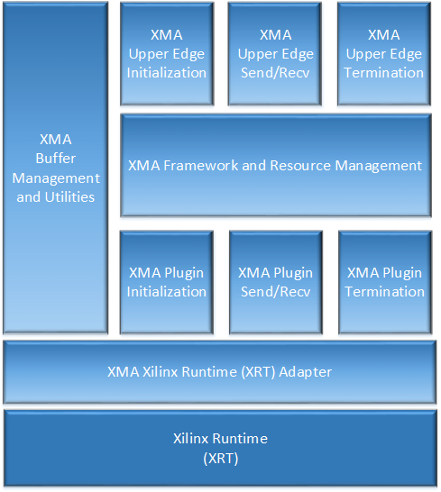

===========================================
Xilinx Media Accelerator (XMA)
===========================================
Major XMA Changes in this 2019.2 Release:
YAML configuration file is not used by XMA
Resource management is not handled by XMA. (See XRM for resource management details)
MPSoC PL & soft kernels are supported in XMA
Direct register read & write is not available
DataFlow kernels are supported (In-Progress)
ZeroCopy support has changed. See below for details
BufferObject added. See below for details
XmaFrame & XmaDataBuffer can use device buffers instead of host only memory
Support for device_only buffers
Session creation & destroy APIs are thread safe now
Multi-process support is from XRT
Register map must be locked (xma_plg_kernel_lock_regmap) by plugin for register_prep_write & schedule_work_item  to work without error. Unlock the register map if other plugins share same CU
Supports up to 60 CUs per device (in-progress; Testcase needed)
CU register map size < 4KB
By default XMA will automatically select ddr bank for new device buffers (as per selected CU). Session_create may provide user selected ddr bank input when XMA will use user select ddr bank for plugin with that session
XMA continues to support only one ddr bank per plugin
XMA version check API added to plugin struct. See below for details

Introduction
---------------

The Xilinx Media Accelerator (XMA) library (libxmaapi) is a host interface
meant to simplify the development of applications managing and controlling
video accelerators such as decoders, scalers, filters, and encoders. The
libxmaapi is comprised of two API interfaces: an application interface and a
plugin interface. The application API is a higher-level, generalized
interface intended for application developers responsible for integrating
control of Xilinx accelerators into software frameworks such as FFmpeg,
GStreamer, or proprietary frameworks. The plugin API is a lower level
interface intended for developers responsible for implementing hardware
control of specific Xilinx acceleration kernels. In general, plugins are
developed by kernel providers as these plugins are specialized user space
drivers that are aware of the low-level hardware interface.

From a high-level perspective, the XMA sits between a media framework (i.e.
FFmpeg)  and the Xilinx runtime (XRT). In addition, the XMA acts as a peer
to the host side implementation of OpenCL. The diagram below illustrates the
entire stack including an example of common accelerator kernels that are
possible in a specific design:

The remaining sections will describe the key architectural aspects of the
libxmaapi and describe the high-level API along with the low-level plugin
API.

XMA Application Interface Overview
----------------------------------------

The API for the libxmaapi can be categorized into three areas:

1. Initialization
2. Video frame processing
3. Termination

From an interface perspective, the high-level or upper edge interface and the
low-level or plugin interface are organized as follows:

The diagram above illustrates a number of distinct API layers.  The XMA upper
edge initialization API provides two types of initialization: global and
session level initialization.  The XMA upper edge API also provides functions
for sending and receiving frames as well as a method for gracefully terminating
a video stream when the end of the stream is found.  Also depicted in the
diagram is the XMA Framework.  The XMA Framework is responsible for 
delegating requests to the appropriate plugin, and selecting user requested
resources based on session creation requests.

See the `Application Development Guide`_ for more information about utilizing the XMA
application interface to development your own stand alone or integrated
applications.

XMA Plugin Interface Overview
----------------------------------

The XMA lower edge API parallels the upper edge API; however, the lower edge
API is comprised of function callbacks similar to those used in a driver or as
defined in the FFmpeg plugin interface.

There are five classes of XMA plugin interfaces: decoders, encoders,
filters, scalers, and a generic 'kernel' class.
Since each of these classes are unique in terms of the processing performed,
the APIs are slightly different, however, there is a common pattern associated
with these classes. Specifically, a plugin must provide registration
information and must implement all required callback functions. In general, an
XMA plugin implements at least five required callback functions: initialize,
send frame or send data, receive frame or receive data, close and xma_version. 

BufferObject contains:
uint8_t* data : Pointer to host buffer space of allocated buffer
uint64_t size: Size of allocated buffer
uint64_t paddr: FPGA DDR Addr of allocated buffer. Use this to pass DDR addr to CUs as part of regmap with xma_plg_register_prep_write API
int32_t  bank_index: DDR bank index
int32_t  dev_index: FPGA device index on which the buffer is allocated
bool     device_only_buffer: If it is device only buffer.
For device only buffers, BufferObject → data == NULL as no host buffer space is allocated

XmaFrame & XmaDataBuffer with device buffers:
xma_frame_from_device_buffers()
xma_data_from_device_buffer()

ZeroCopy use cases:
Use XRM for system resource reservation such that zero-copy is possible
XmaFrame with device only buffer can be output of plugins supporting zero-copy and feeding zero-copy enabled plugin/s
Plugins may use dev_index, bank_index & device_only info from BufferObject to enable or disable zero-copy

By way of example, the following represents the interface of the XMA Encoder
class:

::

    typedef struct XmaEncoderPlugin
    {
        /** specific encoder type */
        XmaEncoderType  hwencoder_type;
        /** Specific encoder vendor */
        const char     *hwvendor_string;
        /** input video format fourcc index */
        XmaFormatType   format;
        /** bits per pixel for primary plane of input format */
        int32_t         bits_per_pixel;
        /** size of allocated kernel-wide private data */
        //size_t          kernel_data_size;This is removed;
        /** size of allocated private plugin data.*/
        size_t          plugin_data_size;
        /** Initalization callback.  Called during session_create() */
        int32_t         (*init)(XmaEncoderSession *enc_session);
        /** Callback called when application calls xma_enc_send_frame() */
        int32_t         (*send_frame)(XmaEncoderSession *enc_session,
                                    XmaFrame          *frame);
        /** Callback called when application calls xma_enc_recv_data() */
        int32_t         (*recv_data)(XmaEncoderSession  *enc_session,
                                    XmaDataBuffer      *data,
                                    int32_t            *data_size);
        /** Callback called when application calls xma_enc_session_destroy() */
        int32_t         (*close)(XmaEncoderSession *session);

        /** Callback invoked at start to check compatibility with XMA version */
        int32_t         (*xma_version)(int32_t *main_version, int32_t *sub_version);

        /** Reserved */
        uint32_t        reserved[4];

    } XmaEncoderPlugin;

Finally, the XMA offers a set of buffer management utilities that includes
the creation of frame buffers and encoded data buffers along with a set of
miscellaneous utility functions. By providing XMA buffer management
functions, it is possible for an XMA plugin to easily integrate with
virtually any higher-level media framework without requiring any
changes. Instead, it is up to the upper level media framework functions to
convert buffers into the appropriate XMA buffer.
The sections that follow will describe the layers of the API in more detail and
provide examples of how these functions are called from both the perspective of
an application and from the perspective of an XMA plugin. For the low-level
details of the APIs, please consult the doxygen documentation.

Sequence of Operations
--------------------------

In order to better understand how XMA integrates with a standard multi-media
framework such as FFmpeg, the sequence diagram that follows identifies the
critical operations and functions called as part of a hypothetical encoder. The
diagram only calls out the initialization and processing stages:

.. image:: XMA-Sequence-Diagram.png
   :align: center

As shown in the diagram above, the system is comprised of five blocks:

- The FFmpeg Command Line application that is used to create a processing graph
- The FFmpeg encoder plugin that interfaces with the XMA Upper Edge Interface to manage a video session
- The XMA Upper Edge library interface responsible for initialization, resource allocation, and dispatching of the XMA plugin
- The XMA Lower Edge plugin responsible for interfacing with the SDAccel Video Kernel
- The XMA Video Kernel responsible for accelerating the encoding function

While this sequence diagram only shows five components, more complex systems
can be developed that include multiple accelerators with the associated XMA
plugin and FFmpeg plugin. In fact, adding new processing blocks is controlled
entirely by the FFmpeg command line and the presence of the requested
accelerator kernels. No additional development is required if all of the
SDAccel kernels are available along with the associated plugins.  In this
example, an FFmpeg command is invoked that ingests an MP4 file encoded as H.264
and re-encodes the file as H.264 at a lower bit rate. As a result, the main()
function of the FFmpeg command is invoked and this calls the xma_initialize()
function. The xma_initialize() function is called prior to executing any other
XMA functions and performs a number of initialization steps that are detailed
in a subsequent section.
Once the xma_initialize() successfully completes, the FFmpeg main() function
performs initialization of all requested processing plugins. In this case, the
hypothetical encoder plugin has been registered with FFmpeg and the
initialization callback of the plugin is invoked. The FFmpeg encoder plugin
begins by creating an XMA session using the xma_enc_session_create() function.
The xma_enc_session_create() function finds an available resource based on the
properties supplied and, invokes the XMA
plugin initialization function. The XMA plugin initialization function
allocates any required input and output buffers on the device and performs
initialization of the SDAccel kernel if needed.

After initialization has completed, the FFmpeg main() function reads encoded
data from the specified file, decodes the data in software, and sends the raw
video frame to the FFmpeg plugin for encoding by calling the encode2() plugin
callback. The encode2() callback function converts the AVFrame into an XmaFrame
and forwards the request to the XMA Upper Edge interface via the
xma_enc_session_send_frame() function. The xma_enc_session_send_frame()
function locates the corresponding XMA plugin and invokes the send frame
callback function of the plugin. The XMA send frame callback function writes
the frame buffer data to a pre-allocated DDR buffer on the device and launches
the kernel. After the FFmpeg plugin encode2() function has sent the frame for
encoding, the next step is to determine if encoded data can be received or if
another raw frame should be sent. In most cases, an encoder will want several
raw frames before providing encoded data. Supplying multiple frames before
generated encoded data improves video quality through a look ahead and improves
performance by allowing new frame data to be written to the device DDR in
parallel with processing previously supplied frames.  Assuming a frame is ready
to be received, the xma_enc_session_recv_data() function is called by the
FFmpeg plugin and in turn results in the receive data function of the XMA
plugin being invoked. The XMA plugin communicates with the kernel to ensure
that data is ready to be received, determines the length of the encoded data,
and reads the encoded data from DDR device memory to host memory.
The description above is meant as a high-level introduction to FFmpeg and XMA.
The remainder of this document covers these topics in more depth and provides
code examples to help illustrate usage of the XMA.

Execution model
-----------------
The APIs are: 
  
  * xma_plg_register_prep_write
  * xma_plg_schedule_work_item
  * xma_plg_is_work_item_done

Lets consider the various purposes where the above APIs would be useful. 

**xma_plg_register_prep_write** should be used to set kernel input arguments which will be used to start the kernel later. 

**xma_plg_schedule_work_item** 
should be used to start the kernel with kernel arguments set earlier with xma_plg_register_prep_write API

**xma_plg_is_work_item_done** should be used to check if kernel has completed atleast one work item (previously submitted by xma_plg_schedule_work_item).

Application Development Guide
----------------------------------

The XMA application interface is used to provide an API that can
be used to control video accelerators.  The XMA API operations
fall into four categories:

- Initialization
- Create session
- Runtime frame/data processing
- Cleanup

Initialization
~~~~~~~~~~~~~~~~~~~~~~
The first act an application must perform is that of initialization of the
system environment.  This is accomplished by calling xma_initialize() and
passing in device and xclbin info. 

Create Session
~~~~~~~~~~~~~~~~~~~~~~
Each kernel class (i.e. encoder, filter, decoder, scaler, filter, kernel)
requires different properties to be specified before a session can be created.

See the document for the corresponding module for more details for a given
kernel type:
- xmadec
- xmaenc
- xmafilter
- xmascaler
- xmakernel

The general initialization sequence that is common to all kernel classes is as follows:

- define key type-specific properties of the kernel to be initialized
- call the_session_create() routine corresponding to the kernel (e.g. xma_enc_session_create())

Runtime Frame and Data Processing
~~~~~~~~~~~~~~~~~~~~~~
Most kernel types include routines to consume data and then produce data from
host memory buffers.  Depending on the nature of the kernel, you may be
required to send a frame and then receive data or vice versa.
XMA defines buffer data structures that correspond to frames (XmaFrame)
or data (XmaFrameData). These buffer structures are used to communicate
with the kernel application APIs and include addresses to host memory.  The XMA Application Interface includes
functions to allocate data from host or device memory and create these containers for
you.  See xmabuffers.h for additional information.

Some routines, such as that of the encoder, may require multiple frames of
data before recv_data() can be called.  You must consult the API to ensure
you check for the correct return code to know how to proceed.  In the case of
the encoder, calling xma_enc_session_send_frame() may return XMA_SEND_MORE_DATA
which is an indication that calling recv_data() will not yield any data as
more frames must be sent before any output data can be received.

Of special note is the XmaKernel plugin type.  This kernel type is a generic
type and not necessarily video-specific. It is used to represent kernels that
perform control functions and/or other functions not easily represented by
any of the other kernel classes.

Cleanup
~~~~~~~~~~~~
When runtime video processing has concluded, the application should destroy
each session.  Doing so will free the session to be used by another thread or
process and ensure that the kernel plugin has the opportunity to perform
proper cleanup/closing procedures.

- xma_enc_session_destroy()
- xma_dec_session_destroy()
- xma_scaler_session_destroy()
- xma_filter_session_destroy()
- xma_kernel_session_destroy()

See XMA copy_encoder & copy_filter examples for more info.

Plugin Development Guide
-----------------------------

The XMA Plugin Interface is used to write software capable of managing a
specific video kernel hardware resource.  The plugin interface consists of a
library for moving data between device memory and host memory and accessing
hardware registers.  Additionally, standard interfaces are defined to
represent various video kernel archtypes such as encoders, decoders, and
filters.

The plugin developer, by implementing a given plugin interface, permits XMA
to translate requests from XMA applications into hardware-specific actions
(i.e. register programming, buffer processing). The XMA plugin is akin to a
software 'driver' in this regard.

The first step in developing an XMA plugin requires you to decide which XMA
kernel interface accurately represents the type of hardware kernel for which
you seek to provide support:

======================================== =========================================
                Kernel Type                           XMA Plugin Interface
======================================== =========================================
Encoders (VP9, H.264, H.265)                   xmaplgenc
Decoders (VP9, H.264, H.265)                    xmaplgdec
Filters (colorspace converter, scalers)   xmaplgfilter or xmaplgscaler
Scalers                                                 xmaplgscaler
Other (embedded cpu)                                   xmaplgkernel
======================================== =========================================

Once selected, the job of the plugin author is to implement the interface
for the given kernel thus providing a mapping between the xma_app_intf and
the kernel.  Most callbacks specified are implicitly mandatory with some exceptions
which will be noted below.

Your plugin will be compiled into a shared object library and linked to the
kernel via create_session properties:

All plugin code must include xmaplugin.h

::

    #include <xmaplugin.h>

This will provide the plugin code access to all data structures necessary
to author XMA plugin code.  This includes access to the structures used
by the xma_app_intf as xmaplugin.h includes xma.h.

What follows is a general description of what is expected of a plugin in
response to the xma_app_intf.

From the application perspective, the following operations
will be peformed:

1. Create session
2. Send data/frame or write**
3. Receive data/frame or read**
4. Destroy

\** in the case of a non-video kernel

Steps 2 and 3 will form the runtime processing of frames/data and likely
repeated for as long as there is data to be processed.

A general mapping between the application interface and plugin interface:

+---------------------+-------------------------------+
| Application Call    |  Plugin Callbacks Invoked     |
+=====================+===============================+
| session_create()    |    init()                     |
+---------------------+-------------------------------+
| send_(data|frame)() |   send_(data|frame)()         |
+---------------------+-------------------------------+
| recv_(data|frame)() |    recv_(data|frame)()        |
+---------------------+-------------------------------+
|  destroy()          |           close()             |
+---------------------+-------------------------------+

Initalization
~~~~~~~~~~~~~~~~~~~~

Initialization is the time for a plugin to perform one or more of the
following:
* allocate device buffers to handle input data as well as output data
* initalize the state of the kernel

When a session has been created in response to an application request,
XMA will allocate plugin data that
is session-specific.

XmaSession::plugin_data member is
available to plugin to store the necessary session-specific
state as necessary. There is no need to free these data structures during
termination; XMA frees this data for you.

To allocate buffers necessary to handle both incoming and outgoing
data, please see xma_plg_buffer_alloc().

Handling Incoming Application Data
~~~~~~~~~~~~~~~~~~~~~~~~~~~~~~~~~~~~

For each kernel type, there is an application interface to send data to be
proceessed (i.e. encoded, decoded, or otherwised transformed).
Data being sent by an application to the kernel will result in the invocation
of your send()/write() callback.

The most common operation within the plugin is to copy data from host
memory to device memory so that it may be operated on by the kernel.
Subsequently, the kernel must be programmed to know which device buffer
contains the data to be processed and programmed appropriately.

The XMA Plugin library call xma_plg_buffer_write() can be used to copy
host data to device data.

xma_plg_register_prep_write() and xma_plg_schedule_work_item() can be used to program
the kernel registers and start kernel processing.

Sending Output to the Application
~~~~~~~~~~~~~~~~~~~~~~~~~~~~~~~~~~~~~~~

For each kernel type, there is an application interface to request processed
data (i.e. encoded, decoded, otherwise transformed) by the kernel.  Data
being requested by an application from the kernel will invoke your
recv()/read() callback implementation.

The most common operation within the plugin is to copy data from device
memory back to host memory so that it may be processed by the application.
Subsequently, the kernel may be prepared for new data to arrive for processing.

The XMA Plugin library call xma_plg_buffer_read() can be used to copy
host data to device data.

Termination
~~~~~~~~~~~~~~

When an XMA application has concluded data processing, it will destroy its
kernel session.  Your close() callback will be invoked to perform the necessary
cleanup.  Your close() implementation should free any buffers that were
allocated in device memory during your init() via xma_plg_buffer_free().
Freeing XmaSession::plugin_data is not necessary
as this will be done by the XMA library.

Zerocopy Special Case
~~~~~~~~~~~~~~~~~~~~~~

Encoders are capable of receiving data directly from upstream video processing
kernels such as filters or scalers.  In such a case, it may improve the
the performance of a video processing pipeline that includes both a filter and
an encoder to exchange data directly within device memory rather than have
the filter copy data back to a host buffer only to be re-copied from the host
to the device buffer of the downstream encoder.  This double-copy can be
avoided if the two kernels can share a buffer within the device memory; a
buffer that serves as an 'output' buffer for the filter but an 'input'
buffer for the encoder. This optimization is known as 'zerocopy'. 

Use XRM for system resource reservation such that zero-copy is possible
XmaFrame with device only buffer can be output of plugins supporting zero-copy and feeding zero-copy enabled plugin/s
Plugins may use dev_index, bank_index & device_only info from BufferObject to enable or disable zero-copy

See XMA copy_encoder & copy_filter examples for more info.

