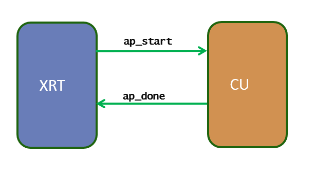
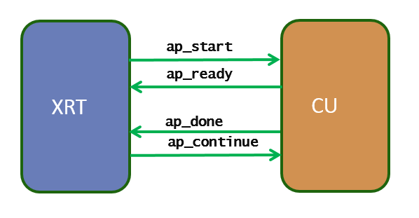

.. _xrt_kernel_executions.rst:

Supported Kernel Execution Models
---------------------------------

XRT can support a few well-defined kernel execution models.  In HLS flow, depending on the pragma embedded inside the kernel code, the HLS generates RTL that resonates with XRT supported models. However, for RTL kernel, as the user has the flexibility to create kernel the way they want, it is important for RTL user to understand the XRT supported execution model and design their RTL kernel interface accordingly.

At the low level, the kernels are controlled by the XRT through the control and status register that lies on the AXI4-Lite Slave interface. The control and status register is mapped at the address 0x0 of the AXI4-Lite Slave interface.

The list of primary supported excution models are:

1. ``AP_CTRL_HS``
2. ``AP_CTRL_CHAIN``
3. ``AP_CTRL_NONE``

The ``IP_LAYOUT`` section of the kernel ``xclbin`` metadata contains the kernel execution model information. The ``xclbinutil`` utility command can be used to retrieve the execution model information from a ``.xclbin`` file.

.. code-block:: none

   xclbinutil --info --input binary_container_1.xclbin --dump-section IP_LAYOUT:json:ip_layout_info.json

.. code-block:: json

   {
    "ip_layout": {
        "m_count": "5",
        "m_ip_data": {
            "ip_data": {
                "m_type": "IP_KERNEL",
                "m_int_enable": "0",
                "m_interrupt_id": "0",
                "m_ip_control": "AP_CTRL_HS",

Below we will discuss each kernel execution model in detail.

=========================================
AP_CTRL_HS (Sequentially Executed Kernel)
=========================================

The AP_CTRL_HS style kernel is the oldest supported model through XRT (before 19.1, this was the only supported kernel type by XRT). The idea of AP_CTRL_HS is the simple one-point synchronization scheme between the host and the kernel using two signals: **ap_start** and **ap_done**. This execution mode allows the kernel only be restarted after it is completed the current execution. So when there are multiple kernel execution requests from the host, the kernel gets executed in sequential order, serving only one execution request at a time.

Mode of operation
~~~~~~~~~~~~~~~~~

1.	The XRT driver writes a 1 in ap_start to start the kernel
2.	The XRT driver waits for ap_done to be asserted by the kernel (guaranteeing the output data is fully produced by the kernel).
3.	Repeat 1-2 for next kernel execution

Assume there are three concurrent kernel execution requests from the host. The kernel executions will happen sequentially as below, serving one request at a time

START1=>DONE1=>START2=>DONE2=>START3=>DONE3

Control Signal Topology
~~~~~~~~~~~~~~~~~~~~~~~
The signals ap_start and ap_done must be connected to the AXI_LITE control and status register (at the address 0x0 of the AXI4-Lite Slave interface) section to specific bits.

====== ===================== =======================================================================
 Bit       Signal name                                  Description
====== ===================== =======================================================================
  0         ap_start           Asserted by the XRT when kernel can process the new data
  1         ap_done            Asserted by the kernel when it is finished producing the output data
====== ===================== =======================================================================

================================
AP_CTRL_CHAIN (Pipelined Kernel)
================================

AP_CTRL_CHAIN is an improved version of AP_CTRL_HS where the kernel is designed in such a way it can allow multiple kernel executions to get overlapped and running in a pipelined fashion. To achieve this host to kernel synchronization point is broken into two places: input synchronization (dictated by the signals **ap_start** and **ap_ready**) and output synchronization (**ap_done** and **ap_continue**). This execution mode allows the kernel to be restarted even if the kernel is working on the current (one or more) execution(s). So when there are multiple kernel execution requests from the host, the kernel gets executed in a pipelined or overlapping fashion, serving multiple execution requests at a time.

Mode of operation
~~~~~~~~~~~~~~~~~

**Input synchronization**

1.	The XRT driver writes a 1 in ap_start to start the kernel
2.	The XRT driver waits for ap_ready to be asserted by the kernel (guaranteeing the kernel is ready to accept new data for next execution, even if it is still working on the previous execution request).
3.	The XRT driver writes 1 in ap_start to start the kernel operation again

Assume there are five concurrent kernel execution requests from the host and the kernel can work on three execution requests in a pipelined fashion. The kernel executions will happen sequentially as below, serving maximum three requests at a time.

START1=>START2=>START3=>DONE1=>START4=>DONE2=>START5=>DONE3=>DONE4=>DONE5

**Note:** As noted in the above sequence, the AP_CTRL_CHAIN only applicable when the kernel produces the outputs for the pending requests in-order. Kernel servicing the requests out-of-order cannot be supported by AP_CTRL_CHAIN execution model.

**Output synchronization**

1. The XRT driver waits for ap_done to be asserted by the kernel (guaranteeing the output data is fully produced by the kernel).
2. The XRT driver writes a 1 in ap_continue to keep kernel running

The input and output synchronization occurs asynchronously, as a result, multiple executions are performed by the kernel in an overlapping or pipelined fashion.

Control Signal Topology
~~~~~~~~~~~~~~~~~~~~~~~
The signals ap_start, ap_ready, ap_done, ap_continue must be connected to the AXI_LITE control and status register (at the address 0x0 of the AXI4-Lite Slave interface) section to specific bits.

====== ===================== =======================================================================
 Bit       Signal name                                  Description
====== ===================== =======================================================================
  0         ap_start           Asserted by the XRT when kernel can process the new data
  1         ap_done            Asserted by the kernel when it is finished producing the output data
  3         ap_ready           Asserted by the kernel when it is ready to accept the new data
  4         ap_continue        Asserted by the XRT to allow kernel keep running
====== ===================== =======================================================================

Host Code Consideration
~~~~~~~~~~~~~~~~~~~~~~~
The host code exercising a AP_CTRL_CHAIN kernel should be able to fill the input queue with multiple execution requests well ahead to take the advantage of pipelined nature of the kernel. For example, considering OpenCL host code, it should use out-of-order command queue for multiple kernel execution requests. The host code should also use API ``clEnqueueMigrateMemObjects`` to explicitly migrate the buffer before the kernel execution.

==========================================
AP_CTRL_NONE (Continuously Running Kernel)
==========================================

Sometimes the kernel does not need to be controlled by the host. For example, if the kernel is only communicating through the stream, it only works when the data is available at its input through the stream, and the kernel stalls when there is no data to process, waiting for new data to arrive through the stream to start working again. These type of kernels has no control signal connected to the AXI4-Lite Slave interface.

**Important points to remember**

1. Consider a kernel with AP_CTRL_NONE only when it has no memory mapped input and output.
2. There is no need to start the kernel by ``clEnqueueTask`` or ``clEnqueueNDRangeKernel`` from the host.
3. Host communicates with a continuously running kernel by the stream read and write requests, if necessary.
4. Dont use ``clSetKernelArg`` to pass scalar argument to ap_ctrl_none kernel, only use ``xclRegWrite`` (API to be implemented in 19.2) API.

**Note:** To read and write register values from the AXI4-Lite Slave interface, the new APIs ``xclRegRead``/``xclRegWrite`` must be used (replacing obsolated APIs ``xclRead``/``xclWrite``). These APIs require exclusive CU context reservation via API ``xclOpenContext`` as shown in the code sample below.

.. code-block:: c

   xclOpenContext(device_handle, xclbin_id, cu_index, false);
   xclRegRead(device_handle, cu_index, offset, &data);
   xclRegWrite(device_handle, cu_index, offset, data);
   xclCloseContext(device_handle, xclbin_id, cu_index);
